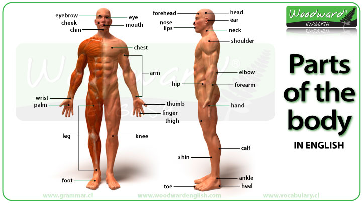
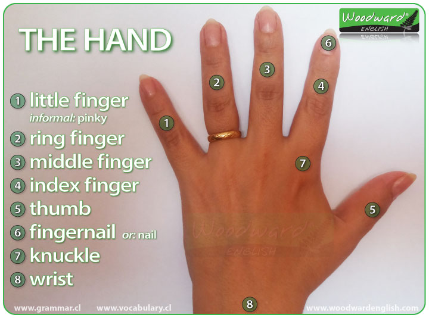

## Unit 4 People

Personal Identification and people


navel	
waist	
abdomen	

thigh	
buttocks	

cheek	

teeth	
	eyelash	
hair	
back	

cerebrum	

cerebellum	
lung	
heart	
stomach	
large intestine	

small intestine	
kidney	
liver	
bladder	


hand	
wrist	
elbow	
belly-button	

ankle	


inside and outside the bod	
personal hygiene	
	take a shower
	take a bath
	use deodorant
	put on sunscreen
	shower cap
	shower gel
	soap
	bath powder
	

```
deodorant
perfume
sunscreen
sunblock
body lotion
wash hair
rinse hair
comb hair
dry hair
brush hair
shampoo
conditioner
hair spray
comb
brush
pick
hair gel
curling iron
blow dryer
hair clip
barrette
bobby pins
brush teeth
floss teeth
gargle
shave
toothbrush
toothpaste
dental floss
mouthwash
electric shaver
razor
razor blade
shaving cream
aftershave
cut nails
polish nails
put on
take off
nail clipper
emery board
nail polish
eyebrow pencil
eye shadow
eyeliner
blush
lipstick
mascara
foundation
face powder
makeup remover
```


### 1-4-1. Talking about families

```
[TODD] Wow! Is that your family?

[SALLY] Yeah. It’s big, huh?

[TODD] Yes, it is.

[TODD] Is this your mother and father?

[SALLY] No, that’s my aunt and uncle. My mother and father are here. And that’s my grandmother and grandfather.

[TODD] And who are they?

[SALLY] My brothers. I have four brothers.

[SALLY] Do you have a big family?

[TODD] Actually, I’m an only child.

[TODD] But, I have Silas, Sarah and my wife, Angela.
```


### 1-4-2. Asking for a description of someone

```
[JAMES] So. Tell me about your date with Laura.

[KEN] She's nice.

[KEN] I like her.

[KEN] I like her eyes.

[KEN] She has beautiful blue eyes.

[KEN] And long, blond hair.

[KEN] And she has a cute smile.
```


### 1-4-3. Describing a colleague

```
[MICHELLE] So! What does he look like?

[LAURA] Who? What does who look like?

[MICHELLE] You know! Ken!

[LAURA] Well ... he's ... tall.

[LAURA] He has short, brown hair.

[MICHELLE] And?

[LAURA] And ... he has green eyes.

[LAURA] And ... he's a firefighter.

[MICHELLE] A firefighter?

[MICHELLE] How old is he?

[LAURA] He's 28.

[MICHELLE] Does he have a brother?
```


```

```


### 1-4-4. People

```
[SALLY] Hey, Todd. I have a question for you.

[TODD] Okay.

[SALLY] Is Joan your boss?

[TODD] Yeah.

[SALLY] What is she like?

[TODD] Well, she’s very hardworking.

[TODD] And she’s really intelligent.

[SALLY] Yeah, but is she friendly to you?

[TODD] She’s not unfriendly. She’s just always busy.

[SALLY] She never smiles.

[TODD] She is very serious.

[TODD] She’s a really good manager.
```


```
[JAMES] I'm a businessman.

[JAMES] I work in an office.

[PAUL] I'm a manager.

[PAUL] I work in a paper company.

[MICHELLE] I'm a sales assistant.]

[MICHELLE] I work in a clothes store.

[MICHELLE] I like my job.

[MICHELLE] I like shopping, and I like clothes.

[MICHELLE] What do you do?

[MICHELLE] Do you like your job?
```

```
A: So What do you do?
B: What do I do, en

B: What do you do
A: What do I do, I'm a doctor.
```

```
I live with John Harrison. He and I are friends. John is from the United Kingdom. He is 25 years old. He's tall and has brown hair and eyes. John is very intelligent and hardworking . He is very friendly . He always smiles.
```




### The Face

- eye, nose, mouth, ear, cheek, chin, nostril, eyebrow, eyelid, eyelash, lips.

**Mouth** - you use your mouth to talk, to eat and to breathe.

**Nose** - You can smell things with your nose. You can also breathe through your nose.

**Nostrils** - these are the two holes in your nose

### The Arm and Hand

- finger, palm, wrist, forearm, elbow, upper arm, shoulder, thumb

### The Hand and Fingers

See the photo of the parts of the hand below

1. hand
2. thumb
3. index finger
4. middle finger
5. ring finger
6. little finger (*informal:* pinky finger)
7. nail
8. knuckle



### The Leg and Foot

- knee, leg, shin, calf (muscle), ankle, heel, foot, toe

**ankle** - the joint between your leg and your foot.


### Internal Parts of the Body

**heart** - your heart pumps your blood around your body.

**lungs** - when you breathe, the air goes into your lungs.

**veins** - these transport blood through your body. They are like little tubes.

**brain** - this is your 'thinking machine' inside your head.

**throat** - food goes down this to get to your stomach.

**liver** - the organ that cleans your blood.

**stomach** - your food goes here when you swallow it.

**kidneys** - the organs that process all your body waste.

**skeleton** - all of the bones in your body.

**ribs** - these are the bones that protect the organs in your chest.

**bones** - your skeleton consists of many bones. There are about 206 in your body.

**skin** - it covers almost the entire body and helps keep all the organs and muscles in place.


### Other Parts of the Body

Here is a list of some other parts of the body that have not been included above. We will take some more photos of these when we find some more volunteers.

- face - hair - tongue - tooth - back - waist - muscles

**neck** - this connects your head with your shoulders and the rest of your body.

**tongue** - the muscle at the bottom of your mouth that tastes things and helps you pronounce words

**wrinkles** - the lines in your skin caused by age. Old people have a lot of wrinkles.