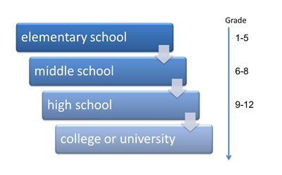

## 7-5 Education

7-5-1 Describing your educational background

7-5-2 Identifying your educational goals

7-5-3 Choosing a training course for staff

7-5-4 Writing about education in your country

----

### 7-5-1 Describing your educational background

```
A: I went to a public elementary school in New York City. I loved it. But when I went to middle school, the classes were big and my grades went down. So, for high school, my parents moves me to a private school. It was expensive, but the teachers were really good. Most of them has master's degrees or doctorates. After high school, I went to New York University. I received a bachelor's degree in literature. I really learned a lot, so it was worth it. At least, I hope my parents thought so.

B: I, uh, grew up in Coventry, in England, and I went to school there. I went on to university at Warwick, and studied for a joint degree in economics and mathematics. I did a BA in business management, then I did an MBA at the University of Michigan. It was challenging, leaving my friends and family in England to study in the US. I really learned a lot about American culture. Oh, and I became addicted to hotdogs.
```

#### a) Vocabulary: 

##### i) school vocabulary

**University 与 college**: 

在美国，college 经常为提供文科学历的一个单独的学院；而 university 则拥有多个学院（工程学院、法学院等）。美国人提及两者时均用 college，除非他们正在谈论某个特定的大学。 使用 university 时，通常在其前面加上一个冠词，如 the。

* I'm going to college in the fall.	秋天我要去读大学了。
* They both went to Pacific University.	他俩都去太平洋大学。
* We play on the volleyball team at the university.	我们在大学里的排球队。

在英国，college 通常是接受继续教育或职业教育的地方；而 university 则是攻读本科学位或研究生学位的地方。这两个词语通常均不与冠词 the 一起使用。

* I'm going to university in the autumn.	秋天我就要去读大学了。

* I went to college to study computer programming.	我上大学学习计算机编程。

在美国，学生们说他们 in college；而在英国，学生们则说他们 at university。

* Paul and his sister are both in college.	Paul和他的妹妹都在读大学。

* Paul and his sister are both at university.	Paul和他的妹妹都在大学里。




Most Americans start their education at age 5 or 6, in **elementary school**. Then they graduate to **middle school**, and finally **high school**. Each year of education is called a grade. Each school may be different, but grades 1 through 5 are usually elementary school, grades 6 through 8 middle school, and grades 9 through 12 high school.

After high school, students can choose to go to a university or college. **Universities** are larger than **colleges** and offer more degrees, like a bachelor's or master's degree. Colleges usually offer only bachelor's degrees.

Students can go to **public schools**, which are paid for by state taxes, or families can pay for their children to go to **private schools**, which some people believe offer a better education, but are usually more expensive.

* **What school is for the first five years of education?**

* **If a student is in grade 12, which school does he or she go to?**

* **What's the best school for a master's degree?**

* **What kind of a school is less expensive?**

* **When do most Americans probably finish high school?**

##### ii) University degrees

大学学历: 获得高中文凭 (high school diploma) 后，美国大学可为你提供众多普通学位，以下是其中的一部分。

* Bachelor of Arts	文学士
* Bachelor of Science	理学士
* Master of Arts	文硕士
* Master of Science	理硕士
* Master of Business Administration	工商管理硕士
* Doctor of Philosophy	哲学博士
* Doctor of Medicine	医学博士

在提及大学学位时，可以使用以下缩写词：


| **学位**                            |       **缩写**     |      **首字母缩略词** |
| ----------------------------------- |  ------------ | ---------------- |
| *Bachelor of Arts*                  |       *bachelor's* |      *BA*  |
| *Bachelor of Science*               |     *bachelor's*  |      *BS*   |
| *Master of Arts*                    |       *master's*   |       *MA* |
| *Master of Science*                 |   *master's*       |      *MS*  |
| *Master of Business Administration* |   *master's*       |   *MBA* |
| *Doctor of Philosophy*              |       *doctorate*  |  *Ph.D.* |
| *Doctor of Medicine*                |   *doctorate*    |    *M.D.*    |

用此类表达来谈论资历和学位：

* I got my BS in political science.	我获得了政治学学士学位。
* Charles did his master's in communications.	查尔斯拿到了通信学硕士学位。
* She has a doctorate in criminal justice.	她拥有刑事司法学博士学位。
* Your qualifications are impressive. Two master's degrees!	你的资历让人印象深刻。竟然是双硕士学位！

---

* I did my **MS** in mathematics.
* After high school, Trent got his **bachelor's** in communications. Now he's doing his master's.
* I'm a Ph.D. I did my **doctorate** in psychology at the University of Washington.
* She got a Bachelor of **Arts** in political science.
* His **qualifications** are impressive. He has a bachelor's from Yale and a master's from Emory.

#### b) Speaking: sentence stress

**句子重音**: 使一个单词听起来更长，并以更高的音高说出来。

* **Private** schools are too **expensive**.

注意，high 和 university 在此句子中重读：

* After **high** school, I went to a private **university**.

你可以通过重读不同的词语，改变句子的含义。注意，如果 private 而不是 university被重读，句子的含义会如何变化。说话人让“大学是私立的”比“她上过大学”这一事实显得重要。

* After **high** school, I went to a **private** university.                                          

除了 private 之外，如果说话人还重读 I，注意句子意思是如何改变的。现在，说话人强调她上了一所私立大学，而也许其他人没有。

* After **high** school, I went to a **private** university.

---

* Sarah went to a public high school. Sarah 在公立高中读书。
* Alex went to a public elementary school. Alex 在一所公立小学读书。
* There weren't any good public high schools. 没有什么好的公立高中。
* Alex went to a private high school. Alex 在一所私立高中读书。
* Sarah's going to a private university. Sarah 打算去一所私立大学求学。

#### c) Expressions: Giving information about your education

- SARAH: Where did you go to school?
- JOHN: I went to Yale University.
- SARAH: What degree did you get there?
- JOHN: I got a BS in political science.
- SARAH: What did you do after you got your bachelor's?
- JOHN: I did a master's in communications.
- SARAH: Would you ever like to do your doctorate?
- JOHN: Yes, I'd like to, some day.

---

* I went to North Hampton High. 我在 North Hampton High 高中读书。
* After high school, I got a bachelor's. 高中毕业后，我获得了学士学位
* I did well in literature. 我文学学得很好。
* I got my MA in political science. 我获得了政治学文科硕士。
* I received a master's in communications. 我获得了通讯硕士学位。
* I'd like to do a doctorate. 我想攻读博士学位。

```
I went to the Beijing Institute of Technology, got my master in Computer Science. In the few years, I'd like to do a doctorate.
```

#### d) Final Task: Describing your education 

```
A: Great to meet you.
B: You, too. Vince says you just got your bachelor's.
A: Yes, that's right.
B: Where did you go to school?
A: I went to Anmer Univeristy, got my bachelor in economics there.
B: Excellent!  Vince said that you did really well.
A: Thanks.
B: So, would you ever like to do an MBA?
A: Yeah, maybe in the few years. But first I need to make some money. How about you, where did you go to school?
B: I went to _____.
A: Cool. What degree did you get?
B: I studied _____.
```

### 7-5-2 Identifying your educational goals

```
A: Hi, Jake. What's up?
B: I just had a meeting with my college counselor.
A: As part of your teaching certificate?
B: Yeah. Umm, my internship's next month, and I talked with my counselor about starting it.
A: How did I go?
B: Good, I guess. I mean, I've never been asked about my goals before.
A: Really? What did you say?
B: At first, nothing. I didn't really have any goals. But then, we talked for a while and I started to ..  began to think of goals.
A: So what were they?
B: Well, first, I want to do the internship and get my teaching certificate.
A: RIght.
B: My second goal is to get a teaching job. And then, I'm interested in getting an MA.
A: That's great.
B: My counselor believes in continuing education. She says we should never stop learning.
A: She's right.
B: What are your goals, Simon?
A: Well, my big objective right now is to get professional development for my team. I'm meeting Joan and Todd tomorrow, to talk about on-the-hob training.
B: Oh, right.
```

#### a) Vocabulary: Professional develpoment

职业发展：Professional development 与 continuing education 

* **Professional development**是指你在高中毕业后加强教育所建立的技能和知识。使用这些表达来谈论职业发展：
  * The head teacher coaches the other teachers as part of their **professional development**.	 	校长为其他教师提供辅导，作为他们职业发展的一部分。 	 
  * HR scheduled some **on-the-job training** so we can learn how to use the new software.	 	人力资源部已经安排了一些在职培训，所以我们可以学习新软件的使用方法。

* **Continuing education** 是指成人在完成高中后加强教育所需的课程。使用这些表达来谈论继续教育：
  * Ernie has a design degree, but now he's **taking a night course** in economics at the local college.	 	欧尼拥有设计学学位，他现在还在本地的大学里上夜校学习经济学。 	 
  * Maybe I'll **get a certificate online**.	 	也许我可以通过网络获得一个文凭。

---

* What form of continuing education does Lisa think she should start with?
* What other course has she always wanted to do?

* What does her counselor suggest she do to get a certificate in marketing?

* What does he suggest Lisa ask about in her job interview?

* What kind of professional development does the university offer her counselor?

#### b) Grammar: Expressions with gerunds

动名词表达: 以介词结尾的表达通常后接动名词 – 词尾为 -ing 的动词。以下是四个后接动名词的表达。你可以用来谈论专业或个人发展。
* think about + 动名词
  * I've **thought about doing** some professional development.	我想过要进行一些职业发展。
* interested in + 动名词
  * Jan's **interested in coaching** other employees.	简对辅导其他员工很感兴趣。 	 	 
* plan on + 动名词
  * He **plans on getting** his MBA. 	他计划攻读工商管理硕士学位。
* look forward to + 动名词
  * I **look forward to taking** a night course.	我想去上夜校。

---

* What's Emily looking forward to?

* What's Emily doing?

* What's Emily interested in?

* What's Emily planning on?

---

* I'm looking forward to studying.
* Sarah's interested in studying philosophy.
* He plans on getting a PH.D.
* What are you thinking about doing?

#### c) Pronuniciation: Reduction of 'you', 'and' and 'to'

you、and 和 to 的弱读: 在英语口语中，并非每个音都要发出。代词、连词和介词等较不重要的单词常常发短音，所以在倾听时，识别这些弱读的单词就很重要。

最常见的三个弱读单词为 you、and 和 to请听以下句子。注意：这三个单词发短音时都采用了相同的音调。

'You'
* Are you taking a night course?
* Frank's gonna coach you.

'And'
* I'm so busy with work and school.
* And then I got my bachelor's.	 

'To'
* Liz is planning to get a certificate online.
* I'd like to do some professional development.

#### d) Expressions: Talking about goals

* What are your plans **for** the future?
* What are you thinking about doing **in** the future?
* My primary **goal** is to take some management courses.
* I'm **interested** in going back to school.
* I'm **planning** on getting a certificate online.

---

* What are your career goals? 你的职业目标是什么？
* My primary goal is to get a promotion. 我的首要目标是升职。
* What are your plans? 你们有什么计划？
* I'm interested in taking some night courses. 我想上夜校。
* What are you thinking about doing? 你在考虑做什么
* I'm planning on getting a certificate online. 我打算通过网络获得一个证书
* That sounds like a great plan. 这听起来是个很棒的计划

#### e) Final task: Identifying your educational goals

```
A: How are you doing?
B: Pretty good. How about you?
A: Not bad. But I'm little word about my career. I think I need more training.
B: What are your plans?
A: Well. My primary goals is to get a better job.
B: What are you thinking about doing?
A: I'm planning on getting an online certificate in programming.
B: That sounds like a good plan!
A: Thanks. So what are your career goals?
B: Well, my primary goal is _____.
A: Great. And after that?
B: Then, I'm planning on _____.
A: Waw. Sounds like we both have great plans.
B: Yes. Good luck with that certificate.
```

### 7-5-3 Choosing a training course for staff

```
A: Okay. Next item on the agenda: Simon, you wanted to talk about professional development?
B: I've been looking for a course that will help our developers get up to date with new techonologies.
A: Okay.
B: I know that cost is important. as is flexibility, especially regarding location and schedule. That's why I'm proposing online study.
C: I thought you were looking at live classes, with a real teacher?
B: Well...
C: I mean, the advantages are obvious. There's a great college near here, and the tutor's an expert in his field.
B: Yes, but these classes have their disadvantages. There's a set schedule, and if you miss a class, you lose it. With online classes, you can study wherever and whenever you want.
C: I guess.
B: And they're also cheaper.
A: In your email, you suggested two dofferent online schools - Thomsen Computer Institute and the University of Wessex.
B: Yes, but I talked to a friend of mine who studied at Thomsen, and he told me it has a bad reputation. Another disadvantage is that it's a private school, so it's expensive.
A: What about Wessex?
B: I've heard a lot of good things abut it. Martin, my senior engineer, gives it a strong recommendation. One good thing is that you meet online with a live instructor once a week.
A: Un-Uhh
B: And another advantage is that you can do one class for free, to see if you like it.
C: That does sound ideal. Do they have a suitable course for your team?
B: They have a short course for people who are already engineers. It just ontroduces the newest technology.
A: How much is it?
B: Three hundred dollars. I have 10 engineers, so...
A: That's not bad at all. So, uh, we've made our decision? We'll go with Wessex.
C: Yep.
B: Great. I'll send you all the details.
```

#### a) Vocabulary: Nouns for courses

1. The online class is too quiet. I like talking with other students in the live class.

2. Your school has a reputation for excellence. Everyone says the instructors are the best.

3. The three-month course is too much for my busy schedule . Is there a short course that takes less time?

4. You don't need to give me your address. I found your location on my mobile phone.

5. Is there any flexibility in the schedule? We're so busy on weekends.

* teacher: instructor
* class taught on the internet:  online class
* the general opinion about something: reputation
* price: cost
* choice of class place: flexibility of location
* choice of class times: flexibility of schedule

#### b) Grammar: 

##### i) Statements with question words

**含有疑问词 + be 的陈述句**: 你可以在陈述句中加入疑问词。注意下例中疑问词 what 和动词 be 的位置。

* I've been thinking about what the best course for me is.	我一直在想什么是最适合我的课程。

在下列含有 know 和 wonder 的例句中寻找疑问词。注意句子结构和降调。

* Bette knows who the instructor is.	贝蒂知道谁是老师。
* I wonder what the schedule is.	我想知道时间表是怎样的。
* I don't know where the school is.	我不知道学校在哪里。
* I wondered how good the instructors were.	我想知道这些老师有多好。
* I wonder what the cost is
* I don't know who the instructors were
* I wonder where the classes are.
* I wonder what the instructor's reputation
* I wonder when the live classes are.
* I wonder what his recommendation is.
* We know how long the course is.
* Roger knows who the instructors are.
* I don't know when the classes are.

##### ii) Question words with '-ever'

**带有 -ever 的疑问词**: 在疑问词后面加上 -ever 来谈论时间、地点或事物的无限可能性。 

* You can study whenever you want.	你什么时候想学时都可以学。
* I take my notebook wherever I go.	无论我去哪里，我都带着我的笔记本。
* I'm looking forward to whatever the instructor teaches.	无论老师教什么，我都满怀期待。
* Whoever took this picture is really creative.	不管是谁 拍的这张照片，他真的很有创意。
* It's a flexible course. You can study however you want.	它是一门灵活的课程，不管你想采用什么方式学习都可以。

---

MALE: The location of the Wellington school isn't great. It's at 414 Brook Place.
FEMALE: That's pretty far. Well, the instructor could come to our office. He said that he can teach **wherever** we choose.
MALE: OK. Now, does he **ever** teach on the weekends?
FEMALE: **What** ? Oh, no – I don't think so. Not on weekends.
MALE: Too bad. This Wellington course is short, but … hmm. Maybe we should try Bronson's **online course** instead. It is longer, and there's no instructor, but …
FEMALE: Yeah, but … then we can study at the office, at a cafe before work …
MALE: Right. We can study **whenever** we want and wherever we want.

---

* Bill takes his notebook wherever he goes.

* You can study whatever you want.

* Jolene takes night classes whenever she can.

* I'm good at whatever I try.

#### c) Expressions: Review: discussing pros and cons

* The obvious **advantage** is that the instructor will teach wherever we want.
* The primary **disadvantage** is cost – $ 1,000 a month is way too much!
* One **good** thing is that we know what their reputation is.
* It's pretty far away. That's a **drawback** .
* A **benefit** is that the schedule is flexible.
* A **bad** thing is that they don't have online classes.

---

* An obvious disadvantage is the cost. 成本是一个明显的劣势。
* A good thing is we can start whenever we choose. 好处是无论我们随时都可以开始上课
* Another benefit is that the schedule is flexible. 其他好处是时间安排很灵活；
* The drawback is we don't know their reputation. 不利之处是我们不了解他们的声誉好坏。
* There's no live instructor. That's one bad thing. 但是没有面对面的老师，这是一大坏处。
* The advantage is that you can study wherever you want. 优点在于你可以在任何地点想学习的时候学习。

#### d) Final Task: Choosing a training course for staff

```
A: Did you find any traning courses that have a good reputation?
B: There's an excellent one at United College. Peter recommended it.
A: What are the advantages and disadvantages?
B: It's online, so an obvious benefit is that we can study wherever we want.
A: That's definitly a good thing.
B: And I know who the instructor is.
A: Oh? Who is it?
B: Well, he taught at Yale. So, that's another advantage.
A: Wa. That sounds good. What's the instructor's schedule?
B: He has a lot of flexibility. Basically, he can teach whenever we want.
A: Unbeliviable. I wonder what the cost is.
B: It's very expensive. That's the only drawback.
A: Well. Okay. Why don't you send me the details?
B: Sure. No problem.
```

### 7-5-4 Writing about education in your country

```
A: Hey, Sally, get this. I just got an email from my mom. She's going back to college.
B: Really?
A: Yeah. She was a mathematics teacher for 40 years. Now she wants to study Spanish.
B: It's not unusual for older people to go back to college.
A: Yeah. I know. But, I wonder: Why Spanish?
B: Maybe she wants to travel.
A: My mom couldn't wait to retire. After 40 years, she'd had enough of the education system.
B: Why?
A: Oh, you know, the usual good news and bad news. One year they'd get more money, but the class size would double.
B: Right.
A: Or, the elementary and middle school students would get new textbooks, but only so they could take more tests.
B: And if the kids didn't pass the test, they failed the grade.
A: Exactly.
B: I'm totally against that. Too much time is spent on tests.
A: You know, my mom had some quite modern ideas. When i was 18, she encouraged me to take a gap year.
B: Cool. I'm all for gap years. I wish I'd taken one.
A: I'm in favor of them, too. But in those days, it wasn't so common for kids to take a year out like that. My mom didn't want me to go straight from school to college. She wanted me to travel and work, and that way I could figure out who I was.
B: It took me years to figure out what I wanted to do.
A: You're lucky. Some people never do.
```

#### a) Vocabulary: Education vocabulary

```
It's Test Time
by Alicia Robins

It's August, and people are going back to college. They're also taking a lot of English language tests.

"The trend in language education is to give students tests many times a year," said Trevor Burke, City College president. "In the 1990s, we only gave tests once a year."

The tests help the college figure out which students need special language classes, he said.

"If the student passes the test, he can continue in his regular classes." But what happens if the student doesn't pass? What if the student fails?

"If the student fails, there are special classes that can help," Burke said. "Or, sometimes, he can take the test again.
```

* **Where would you read this article?**

* **What do many people do in August?**

* **What does 'the trend in language education' mean?**

---

- go to college again: go back to school
- not fail: pass
- solve: figure out
- a change: a trend
- you can read real stories in it: newspaper
- you have to answer questions: test

---

* The newspaper article is about language tests. 报纸这篇文章讨论的是语言考试。
* More and more people are going back to college. 越来越多的人正在重返大学。
* If students don't pass the test, they fail the grade. 没有通过考试的学生则要留级
* Trends show that students are taking more tests. 有趋势显示学生参加的考试正越来越多。

#### b) Expressions: 

##### i) Talking about what's typical

**谈论典型情况**

你可以用以下表达来谈论典型情况。表达中提及名词时用介词 for；表达中提及动词时则用 to。

* It's common for older people to go back to school.	年长者重回学校学习是很常见的。
* It's pretty normal to start college at 18.	18岁开始上大学是相当正常的现象。

你可以用双重否定来加强语气。

* It's not uncommon for classes to start at 2 p.m.	在下午2点开始上课并不少见。

* It's not unusual to study all night before a test.	考试前整夜学习没什么稀奇的。

|典型 |非典型|
|:--:|:--:|
|It's not surprising.|It's surprising.|
|It's the usual story.||
|It's not unusual.|It's unusual.|
|It's normal.|It's not normal.|
|It's not uncommon.|It's uncommon.|

* **What does the man think is unusual?**

* **What does the woman say about giving presentations?**

* **What does the woman think about the man's class?**

* **What does the man say about his class?**

---

* It's pretty normal to study all night before a test. 考试前整夜学习是相当正常的现象。
* It's not surprising that college costs are rising. 大学学费正不断上涨，这一点都不奇怪。
* It's not uncommon for classes to start at 9 a.m. 在上午9点开始上课并不少见。
* It's common to go back to school when you're older. 年纪大了再重返学校读书是个普遍现象。
* It's the usual story - work all day, study all night. 这是个很平常的经历 – 白天工作，晚上学习。
* It's not unusual for wealthy children to go to college. 富家子弟去读大学的并不少见。

##### ii) Talking a stand on an issue

|赞成|反对|
|:--:|:--:|
|I'm in favor of it.|I think that it's wrong.|
|I'm all for it.|I'm against it.|
|I support it.|I disagree with it.|

- I'm all for teachers who give feedback.
- I'm against testing.
- I'm in favor of public education.
- I disagree with weekly tests.
- I think that it's wrong to test kids.

#### c) Reading: Education in the United States

```
I'm in favor of technology in education and, in fact, it's quite common for US colleges to use technology. For example, it's not unusual for students to get degrees online. I'm not surprised, because you can study whenever and wherever you want. Another trend is that students are buying electronic books, or e-books. I totally support the use of e-readers. You can read them on a mobile device – paper books are too heavy to carry! Also, I think it's wrong that paper books cost more than e-books. It's not unusual to pay $100 for a paper book. I'm all for technology in education. I just wish that technology could help me pass Monday's test in math class!
```

- I'm against the cost of books. It's not unusual to pay $100.
- Paper books are hard to carry. They're too heavy.
- I totally support e-books. You can read them on a tablet.
- It's common to use technology. Students get degrees online.

#### d) Final Task: Writing about education in your country

 ```
Class: Trends in Education
Professor Wilson

Assignment: Read the proposal below. Then write your opinion, taking a stand. Support your opinion.

Proposal: Our school committee has proposed that the middle and high schools cut physical education and sports classes next year. Instead, students will have classes for test preparation. Students will have three hours of test preparation a week. These test preparation classes will be all year long.
 ```

```
Some people think it's wrong to have physical education and sports in schools, and the trend in many schools is to focus on helping students pass tests. I'm all for test preparation, but knowing how to stay physically healthy is as important as preparing for tests, and for that reason, I'm against cutting sports from schools.
```

```
In my opinion, I disagree with our school committee. On the one hand, physical education and sports classes are very important for teenagers. To lose these courses will affect teenagers' physical and mental health. On the other hand,  It's so frequently that has test preparation a week. The study is not all for teenagers. 
```

