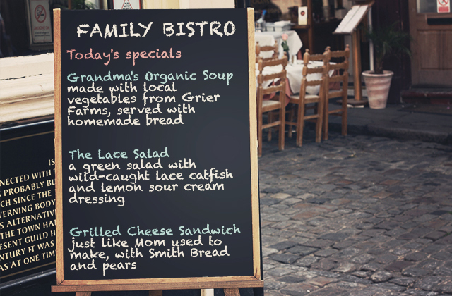

## 9-1 Dining out

9-1-1 Making a dinner reservation

9-1-2 Ordering a meal

9-1-3 Making polite dinner conversation

9-1-4 Ending the meal and paying the check

---

### 9-1-1 Making a dinner reservation

```
[Joan]: Oh, Todd. I have some news. Per Lindstrom is arriving tomorrow from Stockholm.
[Todd]: Great!
[Joan]: Plan on dinner Wednesday night.
[Todd]: Well do.
[Joan]: You had dinner with him in the Stockholm, didn't you?
[Todd]: Yeah.
[Joan]: What kind of food does he like?
[Todd]: Oh, boy. He's really picky.
[Joan]: What - is he vegetarian, or vegan, or something?
[Todd]: No, but he only eats organic. When we ate out in the Stockholm, he kept asking the waiter all these questions. Were the vegetables grown locally, was the salmon wild, were the chickens free range - that sort of stuff.
[Joan]: I see.
[Todd]: Oh, and he's watching his weight, so he'll want fat-free everything.
[Joan]: How about City Chow? They're all organic, and the food's great.
[Todd]: Good idea, I'll make the reservation.
[Joan]: Great.

[Restaurant Employee]: City Chow. How may I help you?
[Todd]: Hi, I'd like to make a reservation for three people, on Wednesday night at 7 o'clock.
[Restaurant Employee]: Okay. Three people. Wednesday night at 7. Just let me check.

[Restaurant Employee]: Uh, would 7:30 work?
[Todd]: Yes, that would be fine. This is a business dinner, so, uh, we'd like a quiet table.
[Restaurant Employee]: That's no problem. I'll put you in the back dining room. It's very quiet there. And what's the name?
[Todd]: Billings. Todd Billings.
[Restaurant Employee]: Okay. Mr.Billlings. We'll see you at 7:30 on Wednesday night.
[Todd]: Thanks, bye.
```

#### a) Vocabulary: Adjectives for healthy and nutaural eating

有关健康天然饮食的形容词

* 请使用与以下词语类似的形容词来谈论健康、天然、负责任地生产的食品：
  * A: Would you like some fruit?	要来点水果吗？
    B: No, thanks. I'm on a low-carb diet.	不要了，谢谢。 我在吃低碳水化合物膳食。

  * I'd like a salad dressing with no oil. And do you have any fat-free or low-fat milk?	我想要没放油的沙拉酱调料。 你们有脱脂或低脂牛奶吗？

  * A: Do you grow organic vegetables?	你们种有机蔬菜吗？
    B: Yes, we do.	是的。 	 

  * Good Eats buys everything from local farms.	“美食”餐厅的每一道食材都来自本地农场。 	 	 

  * This crab is wild, from the Atlantic Ocean.	这是来自大西洋的野生螃蟹。

* 素食者和纯素食者
  * Vegetarians（素食者）不吃肉或鱼，而vegans（纯素食者）不吃肉，鱼，乳制品或鸡蛋。 vegetarian和vegan**都可以用作形容词或名词。

  * A: Is William vegan?	威廉是纯素食者吗？
    B: No, he's a vegetarian. He eats cheese.	不是，他是素食者。 他吃奶酪。

单词与词义

- organic: naturally grown
- local: produced nearby
- low-fat: contains little fat
- low-carb: contains few carbohydrates
- vegan: eats no meat, fish, dairy or eggs
- vegetarian: doesn't eat meat or fish

---



**Questions:** 

| Question             | Answer                       |
| ------------------------------------------------------------ | -------------------------- |
| Paul is vegan. What could he probably eat?               | Soup                       |
| Grace is on a low-carb diet. Which dish is the best choice for her? | The salad                  |
| Ava likes to eat naturally grown food. Which is the best dish for her? | The soup                  |
| What's true about Grier Farms?                           | It is near the restaurant. |
| Where does the catfish probably come from?               | The river                  |

#### b) Reading: Pronoun rederence

代词指代

在使用某一名词（如 restaurant 或 server）之后，可使用 it 或 she 等代词来指代该名词。 例如， it 和 that 可用作主语代词：

* The organic restaurant gets five stars for atmosphere. It's my favorite.	因为氛围很好，这家有机餐厅获得了五星评级。 它是我的最爱。

* We ate at 10 p.m., but that was fine.	我们到晚上10点才吃饭，不过这样也很好。

it 和 that 也可用作宾语代词：

* I like this dish. I ordered it last time I was here.	我喜欢这道菜。 上次我在这儿的时候也点了这道菜。

* The restaurant had very slow service. I hate that.	这家餐厅上菜很慢。 我很讨厌这一点。

 She 和 he 是主语代词。 它们指代之前提到的人。 用 her 或 him 作为宾语代词。

* My aunt is on a low-carb diet. She's losing weight.	我的阿姨在吃低碳水化合物的食物。她在减肥。
* The server was very polite. I gave him a big tip.	那位服务员很有礼貌， 所以我给了他一大笔小费。

------

**Park Grill**

| Hayley S. <br>New Orleans  Ratings (out of 5 stars)                 Food ...... <br>Price ..... <br/>Service ..... <br/>Atmosphere ...... |  |
| :----------------------------------------------------------- | :----------------------------------------------------------- |
|  | I'm a vegan. I ate here last week with a vegetarian friend, here on vacation. She'd never been to the city and **she** wanted to eat local food, so I took **her** to the Park Grill. We both had the spicy red beans and rice. For $15, **it** was too expensive; however, my friend said it was the tastiest bean dish that **she'd** ever eaten at a restaurant. We really liked the atmosphere. **It's** very relaxed. The service was excellent, and our server – wow! **He** was really nice |

| Question                                               | Answer         |
| ------------------------------------------------------ | -------------- |
| Who is 'her'?                                          | The friend     |
| The writer says, 'It was too expensive.' What is 'it'? | The city       |
| The writer says, 'It's very relaxed.' What is 'it'?    | The atmosphere |
| Who is he?                                             | The server     |

#### c) Expressions: Making a restaurant reservation

让自己的谈吐更有礼貌


你可以使用进行式 - 或 would、could 或 may 等情态动词 —— 以便让自己的谈吐更加正式和更有礼貌。

* I'm wondering if you serve food that's locally grown.	我想知道你端上来的食物是否都是本地种植的。
* We were hoping for a 6 o'clock reservation.	我们希望预订6点钟。
* I would like to make a reservation for Sunday evening.	我想要预订星期天晚上。
* How may I help you?	有什么需要帮忙的吗？
* Six-fifteen would work just fine.	六点十五分也很好。
* Could you give us a nonsmoking table?	你能给我们订一张无烟区的餐桌吗？

文化注释： 以礼待人无疑一直是最可取的做法，而在你打算订位或点餐时，如果你使用礼貌和尊重他人的用语，你将会发现自己得到了更好的服务。

---

* Park Grill. How may help you?

* I'm wondering if you have any openings tomorrow.

* What time were you thinking of?

* I was hoping for  6:30.

* I'm putting you down for 6:30.

---

| Question                            | Answer                                                       |
| ----------------------------------- | ------------------------------------------------------------ |
| Good afternoon, how may I help you? | I was wondering if you have any openings tonight.<br> I'd like to make a reservation for Thursday. |
| How many people in your party?      | 12. <br> It's for 12.                                        |
| What time were you thinking of?     | We were hoping for around 6.<br> How about 8?                |
| I'm putting you down for 8:15.      | Perfect.<br> That would be fine.                             |

* I'd like to make a reservation for Sunday evening. 我想要预订星期天晚上
* It's for a party of four. 是一个四人的派对
* We were hoping for a 6 o'clock reservation. 我们希望预订6点钟
* Six-fifteen would work just fine. 六点十五分也很好。
* Yes, please put us down for 6:15. 是的，请将我们安排在6:15。

#### d) Final Task: Making a dinner reservation 

```

```

### 9-1-2 Ordering a meal

```
[Waiter]: Good evening, my name is Rose. I'll be waitress tonight. Are yo ready to order?
[Joan]: Yes, we are. We'll take a dozen oysters as an appetizer. Uh, how fresh are they?
[Waiter]: They were in the bay this morning.
[Joan]: Great. And I'll have the shrimp salad as my entree, and the asparagus as a side dish.
[Waiter]: Anything to drink?
[Joan]: Iced tea, please.
[Waiter]: Okay.
[Lindstrom]: I'll have the chicken with rice and green beans. Uh, are the chickens free range?
[Waiter]: Yes, we get them from a farm in Ridgeville. It's really near here.
[Lindstrom]: Hmm. And how about the green beans? Are they grown locally?
[Waiter]: Yes. they are. All our vegetable are local and organic.
[Lindstrom]: Excellent. Can I also have a bottle of sparking mineral water?
[Waiter]: Certainly.
[Todd]: I'll have the T-bone steak.
[Waiter]: And how would you like your steak?
[Todd]: Medium rare, please.
[Waiter]: What kind of potato would you like with that? Mashed, backed or french fries?
[Todd]: Baked, please.
[Waiter]: Sour cream?
[Todd]: Mmm. Yes, please.
[Waiter]: That comes with the house salad. What kind of dressing would you like?
[Todd]: Oil and vinger, please.
[Waiter]: Anything to drink?
[Todd]: Iced tea, please.
[Waiter]: Okay. I'll be right back with your oysters and drinks.
[Lindstrom]: I like this restaurant.
[Joan]: Yes, it's a favorite of ours.
```

#### a) Vocabulary: Common restaurant foods

|单词|释义|音标|释义(英)|
|:--:|:--:|:--|:--|
|asparagus|芦笋|/əˈspærəɡəs/|a plant whose young green or white stems are cooked and eaten as a vegetable|
|lasagna|卤汁宽面(加肉汁﹑ 蕃茄和乾酪烹制的)|/ləˈzænjə/|an Italian dish made from layers of lasagne pasta, finely chopped meat and/or vegetables and white sauce|
|sparkling mineral water|含气矿泉水|/ˈspɑːrklɪŋ ˈmɪnərəl ˈwɔːtər/|来自地下泉水的水，含有天然矿物质。苏打水中加入二氧化碳气体使其起泡。 <br> 1. I'd like sparkling mineral water to drink, please.<br>2. Would you like still or sparkling mineral water? |
| baked potato|烤土豆|/beɪkt pəˈteɪtoʊ/|a potato cooked in its skin in an oven <br> 1. a baked potato and beans 烤马铃薯和青豆|
| mashed potato|土豆泥|/mæʃt pəˈteɪtoʊ/|potatoes that have been boiled and crushed into a soft mass, often with butter and milk|
| corn on the cob|玉米棒子|/kɔːrn ɑːn ðə kɑːb/|maize (corn) that is cooked with all the grains still attached to the inner part and eaten as a vegetable|
|T-bone steak|T骨牛排|/ti boʊn steɪk/|a thick slice of beef containing a bone in the shape of a T|
|oil and vinegar dressing|油醋汁|/ɔɪl ənd ˈvɪnɪɡər ˈdresɪŋ/|a dressing for salad usually made with olive oil, some type of vinegar and herbs.<br> 1. Barry prefers oil and vinegar dressing.<br> 2. a simple oil and vinegar dressing|
|shrimp salad|虾仁沙拉|/ʃrɪmp ˈsæləd/|a cold dish made with shrimp and usually mayonnaise. <br> 1. Danielle brought a shrimp salad to the picnic. It was so flavorful! <br> 2. cold shrimp salad|
|green beans|青豆|/ɡriːn biːnz/|a type of bean which is a long thin green pod, cooked and eaten whole as a vegetable. <br> 1. Cut the green beans into bite-sized pieces|


usually  entree


#### b) Grammar: Counters

**柜台**: 可以用装食物的容器来说明食物的数量。 在表示不可数名词（如 water 或 bread）的数量时，由于它们没有复数形式，因此 a bottle of 和 a package of 等量词特别有用。

* 用 a bottle of 或 a liter of 来说明某些液体的数量。
  * A: I'd like a T-bone steak and a bottle of sparkling mineral water.	我想要一份 T 骨牛排和一瓶发泡矿泉水。
    B: Certainly. A T-bone, and would you like a liter of sparkling mineral water or just a small bottle?	行。 一份 T 骨牛排，你想要一升发泡矿泉水还是只是一小瓶？	 
  
* 用 a package of 来说明某些固体的数量。

  * We didn't have dessert at the restaurant, so after dinner we bought a package of cookies.	我们在餐厅没有吃甜点，所以吃完饭后，我们买了一袋饼干。	 
  
* 用 a carton of 来说明某些液体和固体的数量。

  * You're still thirsty? I think you've had a carton of milk already.	你还渴吗？ 我觉得你已经喝了一盒牛奶了。
    
  * They brought out four huge cartons of ice cream and let us choose what we wanted.	他们拿出来四大盒冰淇淋，让我们选自己想要的。 	 
* 用 a loaf of 说明成块烘焙的面包的数量。
  * She served a loaf of bread hot from the oven.	她端上来一块刚刚出炉的热面包。

* 另一个有用的量词是 a dozen。 它指的是12个。
  * The chef puts a dozen fresh, local eggs in each quiche.	厨师在每个乳蛋饼中放了12只新鲜的本地鸡蛋。
  * We'd like a dozen oysters, please.	我们想要12只牡蛎。

| 单词                               | 释义           | 图片                                                         |
| ---------------------------------- | -------------- | ------------------------------------------------------------ |
| a package of cookies               | 一包饼干       |  |
| a carton of ice cream              | 一盒冰淇淋     |  |
| a dozen oysters                    | 一打牡蛎       |  |
| a liter of sparkling mineral water | 一升气泡矿泉水 |  |
| a loaf of bread                    | 一条面包       |  |

---

* We ate a package of cookies and watched TV. 我们吃了一袋曲奇，还看了电视。
* Can you buy me a loaf of fresh bread at the bakery? 你能帮我在面包店买一块面包吗？
* I'll have a liter of sparkling mineral water, please. 我想要一升发泡矿泉水，谢谢。
* I was so thirsty, I drank a whole carton of milk. 我太渴了，所以喝了一整盒牛奶
* I'd like a dozen oysters to start with. 我想先来12只牡蛎。

#### c) Expressions: Ordering

**点餐**

在一些国家，服务员在为你点餐之前先进行自我介绍是很常见的现象。

* A: Hi. I'm Casey. May I take your order?	你好。 我是凯西。 我可以帮你点餐吗？
  B: Yes, please. I'd like the lasagna.	好的，谢谢。 我想要烤宽面条。
  
* A: Have you all decided?	你已经全部想好了吗？
  B: We're going to have a dozen oysters to start, please.	我们想先点十二只牡蛎，谢谢。	 	 
  
* A: And for your main course?	那你的主菜呢？
  B: I'm going to have the T-bone steak.	我想点 T 骨牛排。

服务员可能会问你想要怎样的食物烹饪方式。

* A: How would you like your steak?	你的牛排要几分熟？
  B: Medium rare, please.	三分熟，谢谢。	 
  
* A: What kind of potato – mashed, baked or french fries?	什么样的土豆 - 用来做土豆泥，烤或炸薯条？
  B: I'll take mashed, thanks.	我想要土豆泥，谢谢。

你可能还想问一些与食物相关的问题。

* Are the oysters fresh?	牡蛎新鲜吗？

* Do you have any local red wine?	你们有当地的红葡萄酒吗？

* What does the lasagna come with?	烤宽面条有什么配菜？

下列这些类目将描述你想要你的牛排如何被烹饪？

* well done	全熟

* medium well	七分熟

* medium	五分熟

* medium rare	三分熟

* rare	一分熟

你更喜欢哪一种？

-----

- I'd like a local wine.                       Red or white?
- Is the asparagus fresh?                It is, and it's organic.
- May I get a baked potato?           Sure. With sour cream?
- How would you like your steak? Medium rare, please.
- What does it come with?              A house salad.
- Have you all decided?                   Yes, we'd like pizza.

| Question                                          | Answer                      |
| ------------------------------------------------- | --------------------------- |
| What does the man want for an appetizer?          | Shrimp salad                |
| How fresh is the shrimp?                          | The server is uncertain.    |
| What does the man finally order as a main course? | Steak with mashed potatoes  |
| What will the man do with the oil and vinegar?    | Use it as a salad dressing. |
| How would the man like his T-bone?                | medium rare                 |
| What does the man want to drink?                  | wine                        |

---

* What does the steak come with? 牛排配的什么？

* I'd like the steak rare, please. 我要一分熟的牛排，谢谢。

* How fresh are your vegetables? 你们的蔬菜有多新鲜？
* I want the corn soup to start, please. 我想先来一份玉米汤，谢谢。
* Can I also have some french fries? 我能再点一些法式炸薯条吗

#### d) Reading: Eating in a restaurant

> **Culture Corner: Eating out**
>
> You sit at a comfortable table, and your server immediately introduces herself: 'Hello. I'm Julia. I'll be your **server** tonight.' Don't be surprised if the server gives you his or her first name. Most restaurants want you to feel comfortable, so servers are often **informal** but polite.
>
> 
>
> Your server will also ask you a lot of **questions** about your order – questions like 'How **would** you like that?' and 'What kind of **dressing** would you like on the salad?' After you start eating, your server may also come back to the table several times, asking, 'How is **everything**?' Don't worry; that's normal. Tell the server what you think, honestly and politely. The server wants to make sure you get exactly what you want and that you are pleased with your food.
>
> After you've eaten, you may still have some food on your plate. That's fine. Your server might ask 'Would you like to take that home with you?' If you do want to take the food home to eat later, the server will put the food in a package 'to go.'
>
> Finally, it's important to give your server a tip before you leave. Servers usually expect a tip that is at least 15 percent of the bill, but customers sometimes leave a 20 percent tip for excellent service.

----

| Question                                             | Answer                          |
| ---------------------------------------------------- | ------------------------------- |
| What might a server do to help you feel comfortable? | Tell you his or her first name. |
| Why does the server ask so many questions?           | To make sure you are happy.     |
| How should you answer the server?                    | Honestly.                       |
| What might the server do at the end of the dinner?   | Put your food in a package.     |
| What's a good rule for leaving a tip?                | Leave 15 percent or more.       |

---

- How is everything?：asked to make sure that you are pleased
- tipping：leaving at least 15 percent
- how servers speak：informally but politely
- to go：when food is packaged to take home

#### e) Final Task: Ordering a meal

```

```


### 9-1-3 Making polite dinner conversation

```
[Lindstrom]: Anyway, our new directed of engineering is excellent. By the time I get back, your software will be ready and tested. We'll deliver it next Monday.
[Joan]: That's very good news.
[Waiter]: Excuse me. sorry to interrupt. Here is your cappuccino with fat-free milk. Here is your lemon sorbet, and a black coffee, no sugar.
[Joan]: And here's your cherry tart and an espresso.
[Todd]: Thanks.
[Linndstrom]: I'd like to say something. I want to thank you both for your patience with we were working through our problems. We're back on track, and everything's looking good. It's a huge weight off my mind.
[Todd]: I know exactly what you mean.
[Joan]: Yes, I couldn't agree more. I'm looking forward to working more with you in the future.
[Linndstrom]: Thanks, and me too. Speaking of work, tommorrow I'm going to take the day off. I was thinking of visiting the Springdale TV Tower.
[Joan]: That's a wonderful idea. You get an amazing view of the city from the top. And, Per, I think you deservice a day off.
[Todd]: I was just about to say the same thing. I know how hard you've worked to get this project back on track.
[Waiter]: Excuse me. Will there be anything else?
[Joan]: No, I don't think so. Todd and I were talking just the other day about how we need to find more time to relax.
[Linndstrom]: I'm totally with you there. Stressful projects. Long flights, I hardly see my family anymore.
[Todd]: Crazy. Isn't it? Family should always come first.
[Linndstrom]: I couldn't have said it better myself.
[Joan]: To family, then.

```

#### a) Vocabulary: Dessert and coffee

| 单词          |                                                              | 音标             |                                                              |
| ------------- | ------------------------------------------------------------ | ---------------- | ------------------------------------------------------------ |
| brownie       | 巧克力蛋糕 | /ˈbraʊni/        | a thick soft flat cake made with chocolate and sometimes nuts and served in small squares.<br/>a fudge brownie 巧克力夹心饼 |
| bread pudding | 面包布丁 | /bred ˈpʊdɪŋ/    | a dessert made with chunks of bread soaked in milk and baked with eggs, sugar, dried fruit, and spices<br/>We had bread pudding for dessert last night.<br/>ordering white chocolate bread pudding |
| espresso      | 浓咖啡 | /eˈspresoʊ/      | strong black coffee made by forcing steam or boiling water through ground coffee |
| cheesecake    | 乳酪蛋糕 | /ˈtʃiːzkeɪk/     | a cold dessert (a sweet dish) made from a soft mixture of cream cheese, sugar and eggs on a base of cake or crushed biscuits/cookies, sometimes with fruit on top<br/>a strawberry cheesecake 草莓奶酪蛋糕 |
| tart          | 馅饼 | /tɑːrt/          | an open pie filled with sweet food such as fruit <br/> a strawberry tart 草莓馅饼 |
| sundae        | 圣代冰淇淋 | /ˈsʌndeɪ/        | a cold dessert (= a sweet dish) of ice cream covered with a sweet sauce, nuts, pieces of fruit, etc, usually served in a tall glass |
| creme brulee  | 焦糖布丁 | /ˌkrem bruːˈleɪ/ | a dessert consisting of custard (cooked, flavored cream) topped with sugar heated until it becomes hard like a shell. <br/>Creme brulee is my favorite dessert. <br/>eating creme brulee at the new French restaurant |
| cappuccino    | 卡普奇诺咖啡 | /ˌkæpuˈtʃiːnoʊ/  | a type of coffee made with hot frothy milk and sometimes with chocolate powder on the top |

#### b) Grammar: Review: time expressions

复习：时间表达

* 谈论时间的方法有很多。 用 on 说明某一事件发生的日期。
	* We're going to Vegas on Friday.	我们周五将要去拉斯维加斯。
  
* 用 at 说明某一事件发生的时间。
	* Our plane leaves at 6:40.	我们的飞机6:40起飞。
  
* 用 for 来谈论具体数量的时间。
	* Dan's lived there for six years.	丹已经在那里住了六年了。
  
* 用 from 和 to 来谈论一段完整的时间。
	* We worked together from 2009 to 2012.	在2009年至2012年期间，我们曾一起共事。

* 用 until 来谈论某一事件之前的时间。
	* They're going to play until 7.	他们想玩到7点。

* 使用诸如 when 和 by the time 之类的某些时间表达可将两件事件联系在一起。
	* I was gardening when I heard the phone ring.	听到电话响时，我正在花园里干活。
	* It was late by the time Lucy got home.	露西到家时已很晚了。

* 用 while 来谈论两件同时发生的事件。
	* Christie slept while I watched the movie.	我看电影时，克里斯在睡觉。

* 用 as soon as 来谈论某个已完成的时间点。
	* As soon as we're finished with this project, I'm going to take a vacation.	我们一完成这个项目我就去度假。

| Question                                                     | Answer                                 |
| ------------------------------------------------------------ | -------------------------------------- |
| When are they going to the park?                             | As soon as he finishes his cheesecake. |
| What are the hours for the concert?                          | It goes from 8 to 10.                  |
| How long does the concert last?                              | for two hours                          |
| Olivia says that the concert will be over **by the time** the waiter comes back. | by the time                            |
| Aidan wants to talk about their plans **while** they wait    | while                                  |
| Olivia wants to wait **until** they get to the park to talk about their plans. | until                                  |

----

* The band is going to play **until** 10 p.m.

* I'm going to go right to the Eiffel Tower **when** I get to Paris.

* As **soon** as we're finished, let's walk around town.

* Jim waited at the airport **for** three hours.

* By the **time** dinner comes, I'll be a hundred!

* The concert is **from** 7 to midnight.

#### c) Expressions: 

##### i) Politely interrupting

打断


打断别人说话时，要记住两件重要的事。第一，务必礼貌，使用 excuse me 和 I'm sorry 等类似表达。第二，在别人说完一句话再打断，不要在开始说一句话时打断。使用类似这样的表达来插话。

* A: I think that this fish is delicious! And …	我觉得这鱼非常好吃！还有……
  B: Excuse me for interrupting, but here's your salad.	对不起，打断一下，这是您的沙拉。

* A: I love this restaurant. I come here once or twice a month.	我很喜欢这家餐厅。我一个月来一到两次。
  B: Sorry to interrupt, but our movie starts in 30 minutes. We should leave soon.	不好意思，打断一下，我们的电影还有半小时就开始了。我们得马上走了。

使用类似下面的表达补充他人的观点，或者表述与之相反的观点。注意，这些说话技巧比直接打断要礼貌得多。

* A: Well, both the T-bone steak and the lasagna look really good. I can't decide.	嗯，丁骨牛排和千层面看起来都不错。我不知道点什么好。
  B: I'd like to add something. The T-bone is from a local farm. It's organic beef.	我想补充几句。丁骨牛排来自当地农场，是有机牛肉。

* A: I'm not sure that the Garlic Barn is the best restaurant for our business lunch.	我不敢说 Garlic Barn 是不是最适合我们的商务午餐的餐厅。
  B: May I say something? I ate there with friends last week, and it was incredible!	我可以说两句吗？我上周和朋友吃过，非常不错！

| Question                                                     | Answer                                          |
| ------------------------------------------------------------ | ----------------------------------------------- |
| What does Olivia say before she asks about dessert?          | Excuse me … Sorry to interrupt.                 |
| Olivia says, 'That reminds me.' Why?                         | She wants to add something to the conversation. |
| Aiden says that Chad is the most negative person he's ever met. How does Chelsea interrupt? | May I say something                             |

----

* Sorry to interrupt. 不好意思，打断一下
* May I say something? 我可以说两句吗？
* I'd like to add something. 我想补充几句。
* Excuse me for interrupting. 对不起，打断一下。

##### ii) Supporting someone's opinion

> CHELSEA: So, congratulations! You finished the Balboa project. Honestly, that was the worst project. You should totally relax on your vacation.
> AIDEN: Thanks. **I couldn't have said it better myself**. Olivia and I need a real break.
> CHELSEA: **I know exactly what you mean**. I'm thinking of taking some days off too.
> AIDEN: Cool. We actually bought tickets to fly to Koh Rong, Cambodia. We can go diving in the morning and swimming at night.
> CHELSEA: Excellent. You should spend lots of time on the beach.
> AIDEN: Yeah, **I'm totally with you there**. All this snow we've been having is depressing.
> CHELSEA: **I couldn't agree more**. I'm ready to move to Hawaii!
> AIDEN: Hey, we should get a couple of sundaes to celebrate the project.
> CHELSEA: **I was just about to say the same thing** . Sundaes and espressos!

- I couldn't have said it better myself. 我正是这个意思。

- I know exactly what you mean. 我完全知道你的意思。

- I'm totally with you. 我完全赞同你。

- I couldn't agree more. 我完全同意。

- I was just about to say the same thing. 我完全知道你的意思。

#### d) Final Task: Ordering a meal

```

```


### 9-1-4 Ending the meal and paying the check

```
[Lindstrom]: That was really good food. 
[Joan]: My shrimp salad was excellent. Really fresh.
[Todd]: I'm stuffed.
[Lindstrom]: I know. I couldn't eat another bite.
[Waiter]: Would anyone like more coffee?
[Joan]: Um, no, I don't think so.
[Waiter]: Anything else?
[Joan]: No, just the check, please. This is on IXW.
[Lindstrom]: Oh, no, Joan. After all the problems we ...
[Joan]: You're our guest. We'll pay.
[Lindstrom]: Well, if you insist. I really appreciate it. Well, thank you for a lovely meal. It was wonderful seeing you both again. Next time, in Stockholm?
[Joan]: Yes, I'll be there in a few weeks.
[Lindstrom]: And thanks again for your patience over the last few months.
[Todd]: Simon tells me the new beta version of the software is incredible.
[Lindstrom]: I'm glad to hear it.
[Todd]: Oh, and have a great time at the TV tower tomorrow.
[Lindstrom]: Thanks. And give my regards to your wife. It was so nice meeting her.
[Todd]: I will.
[Lindstrom]: Well, take care.
[Todd]: You too.
[Joan]: Bye.
[Lindstrom]: Bye.
```

#### a) Writing: A restaurant meal

撰写正确的分句

用英语写作时，每个分句中都应用一个主语加上一个谓语动词。 尽管有例外情况，这仍是一个不错的经验法则。

* I recently ate at a really cool restaurant.	我最近在一家的确很棒的餐厅吃饭。
* We had drinks, appetizers, a main course and dessert.	我们喝了饮料、吃了开胃菜、主菜和甜点。
   	 

在带有一个主句和一个从属分句的句子中，每个分句都需要一个主语和一个谓语动词。

| **主句**                                                     | **从属分句**                                                 |
| ------------------------------------------------------------ | ------------------------------------------------------------ |
| **We** **ordered** the perfect espresso 我们点了这杯完美的意式浓缩咖啡 | *when **we** **finished** dessert.* 当我们吃完甜品时。       |
| **Everything** **was** fresh and delicious, 每道食物都很新鲜和美味， | *so **we'll** probably **go** again.* 所以，我们可能还会再去。 |


**We** recently **ate** at a new restaurant called Bim's. I ordered the T-bone steak. I **asked** for mashed potatoes and a side of asparagus. It was wonderful! My **friend** got the lasagna. As soon as we finished our main course, we ordered bread pudding and cappuccinos. Both **were** excellent. **Everything** was delicious, so we'll probably go again. But first, I have to go back on my low-carb diet.


#### b) Expressions: 

##### i) Paying the check

买单

在将你的 check 或 bill 拿来之前，服务员会问你是否已用餐完毕。

* A: Would you like anything else?	你还想再要点别的吗？
  B: No, thanks. Just the check.	不要了，谢谢。 买单吧。 

你也可以告诉服务员你准备买单。

* Could we have the check, please?	可以麻烦你把帐单给我们吗？ 	 

用以下表达方式来提出买单和对买单的人表示谢意：

* A: The meal's on me.	这顿饭我请客。
  B: That's very generous. I appreciate it.	你真大方。 非常感谢。

注意在下列对话中这名男士是如何礼貌地拒绝、最终又是如何接受别人的好意的：

* A: I'll take that.	我来请。
  B: You don't have to do that!	你不必这么做的！
  A: I insist. You're my guest.	一定得让我请。 你是我的客人。
  B: Well, if you insist. Thanks very much.	好，如果你坚持的话。非常感谢。	 	 

文化说明：在商务聚餐 结束后，一方通知 会请客。但是在更多的非正式的场合，通常会平摊费用，有一个人会负责计算费用并告诉大家每人应该付多少钱。有时，人们会计算各自点的食物是多少钱各自买单，或者每人要求单独的账单。如果你不清楚该怎么买单，你可以问一下。

* A: So, how are we paying the check?	我们怎么买单呢？
  B: How about we each pay for what we had?	我们各付各的怎么样？ 	 	 

* A: Shall we split the bill equally?	我们AA制好吗？
  B: Yeah, good idea.	好的，好主意。
  A: That comes to, uh, 22 each.	每人共计22。

##### ii) Closing a conversation

* Let's keep in touch. 保持联系。
* Well, thank you for the wonderful meal. 嗯，谢谢你请我吃了一顿美餐。
* Give my regards to your family. 请代我向你的家人问好。
* Well, it was lovely seeing you again. Take care. 哦，再见到你真高兴。保重
* Thanks again for your hard work. 再次感谢你的辛勤工作
* Next time, in Bangkok. 下次，我们曼谷再聚
* Enjoy the rest of your stay. 祝你在余下的时间里过得愉快。

---

* Well, thank you for a wonderful **meal** .

* Next **time** , in Johannesburg.

* Thanks again for your patience. Let's **keep** in touch.

* Give my **regards** to your family.

* Enjoy the rest of your **stay** .

* I'll be in **touch** .

* It was great seeing you. **Take** care.

#### c) Final Task: Ending the meal and paying the check

