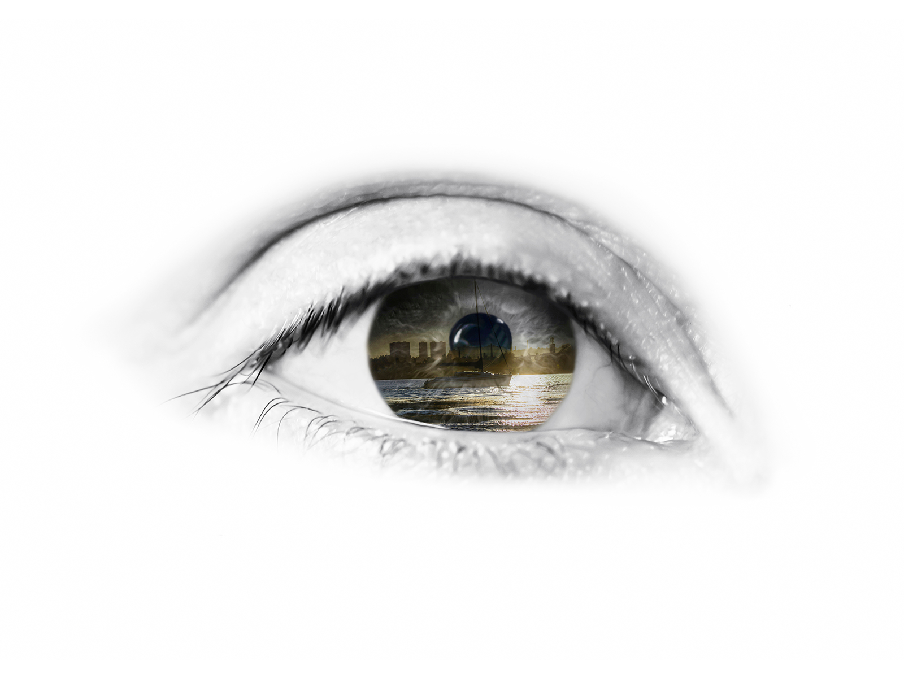
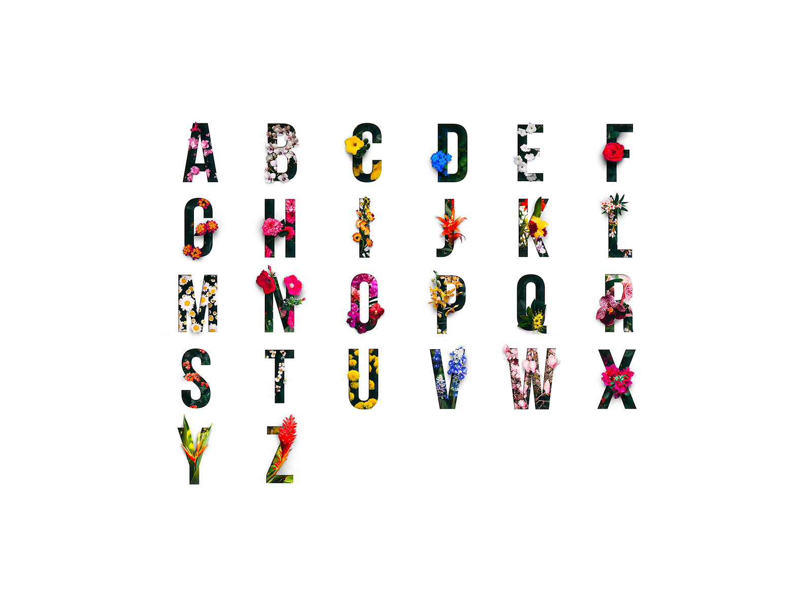

## 0-1 Letters and words

0-1 Letters and words 字母和单词
* 0-1-1 Prepare for class 上课准备
* 0-1-2 Review and practice 复习和练习

---

### 0-1-1 Prepare for class

#### 1 Listening: Multisensory Learning

听力-多感学习法：感官(看+听+说+动作)+日常用到的单词

<video class="ets-vp " width="640" height="360" playsinline="playsinline"   controls poster="../../assets/EF_0-1.jpg" src="https://cns2.ef-cdn.com/Juno/51/64/00/v/516400/U1.mp4"  ></video>

#### 2 Expressions: Letters and words

Listen. Choose the letter that is heard.

A B C D E F G H I J K L M N O P Q R S T U V W X Y Z

#### 3 Vocabulary: Letters and words

* Listen. Choose the correct word.
  * write name close say listen open partner eyes see letter

  * |         |                                                          |          |
    | ------- | -------------------------------------------------------- | -------- |
    | Write   |        | 写       |
    | Name    |         | 名字     |
    | Close   |        | 闭上     |
    | Say     |          | 说       |
    | Listen  |       | 听       |
    | Open    |         | 睁开     |
    | Partner |      | 学习搭档 |
    | Eyes    |         | 眼睛     |
    | See     |          | 看       |
    | letter  |  | 字母     |
  
* EF Classroom language. Remember this classroom language.
  * Close your eyes.  闭上你的眼睛。
  * Listen to the three letters.	  听字母。
  * Open your eyes.	  睁开眼睛。
  * Write and say the letters. 写并说出字母。
  * Say the four letters to your partner

* Listen to the audio and choose the correct answer.

#### 4 Final Task: Names

* How do you write your name?	你的名字怎么写？ 
* What is your name?	 你叫什么名字？
* My name is Ann.   我叫 Ann

### 0-1-2 Review and practice

#### 1 Vocabulary: Letters and Words Review

#### 2 Final Task: Letters and Words Review

