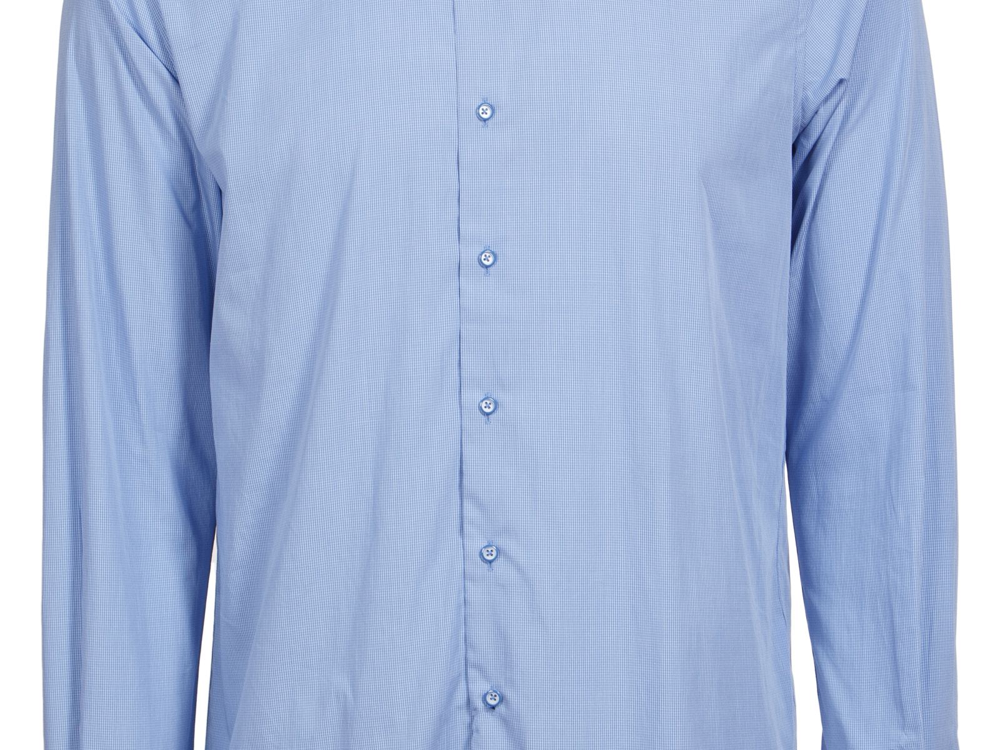
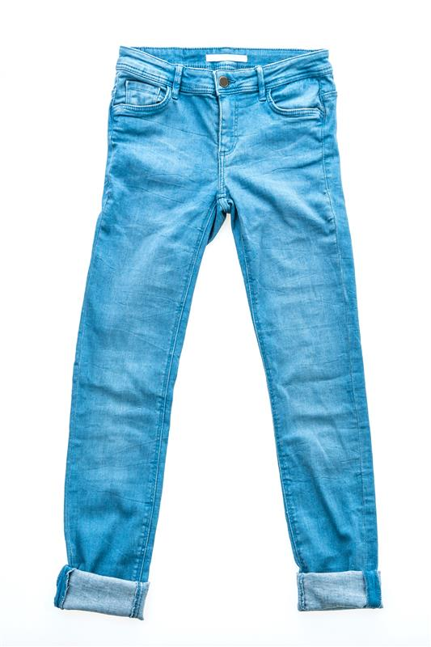
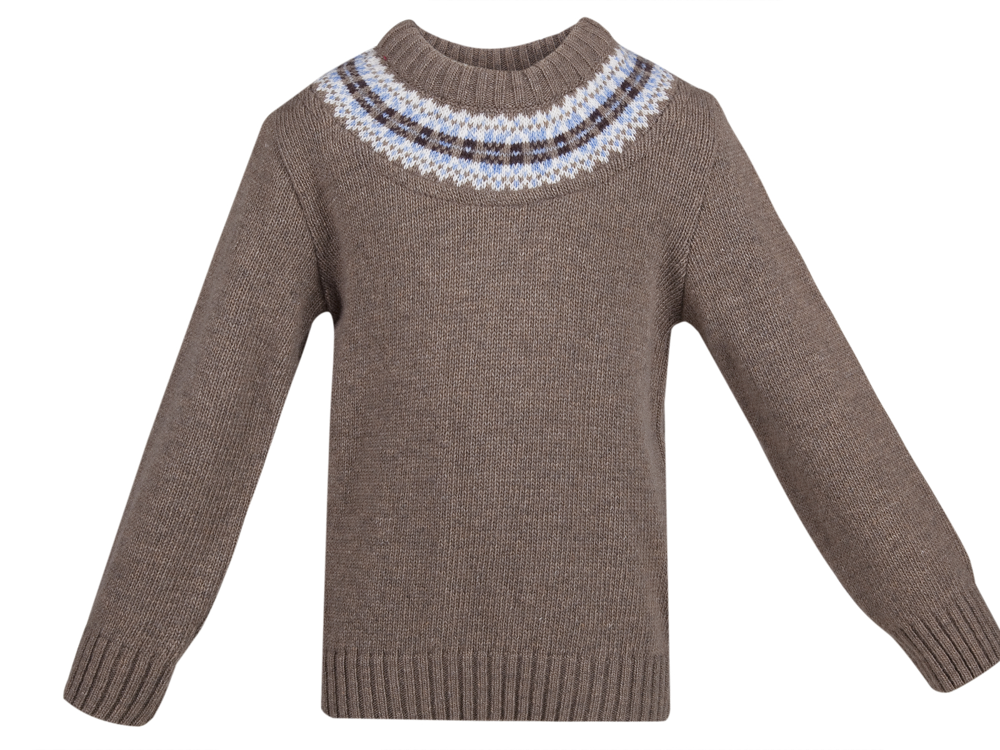
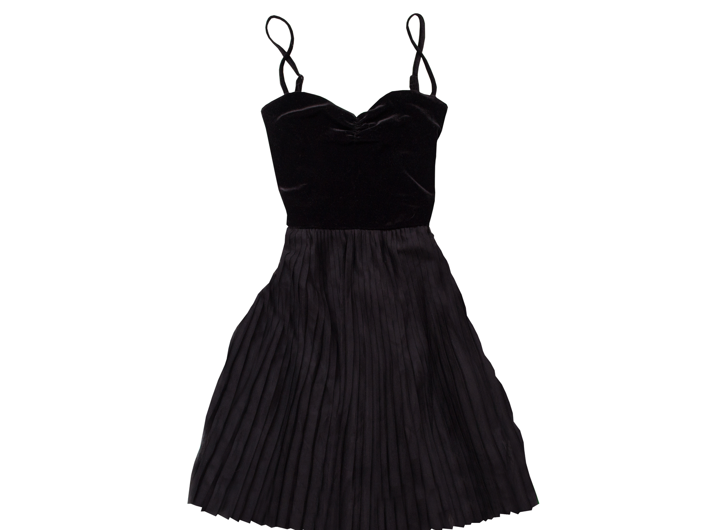
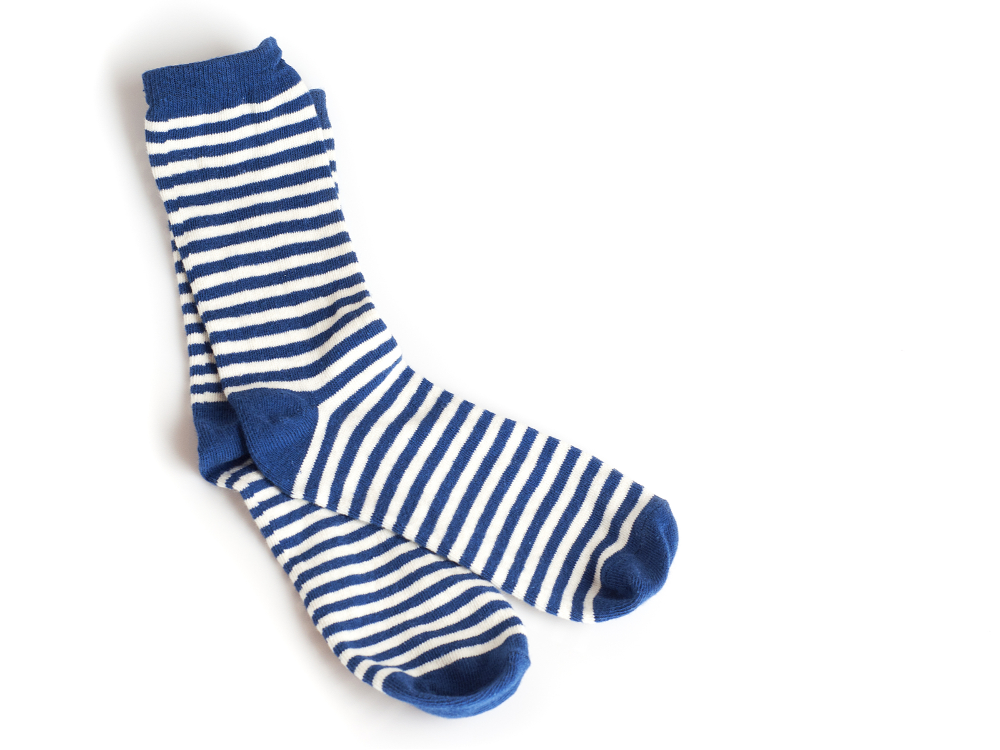
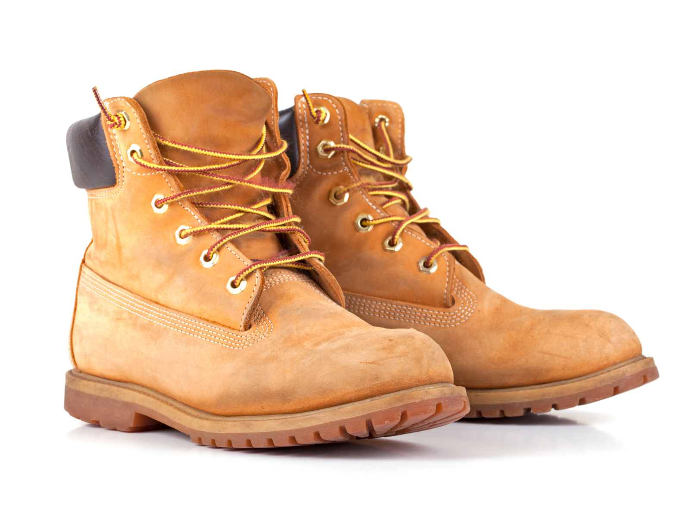
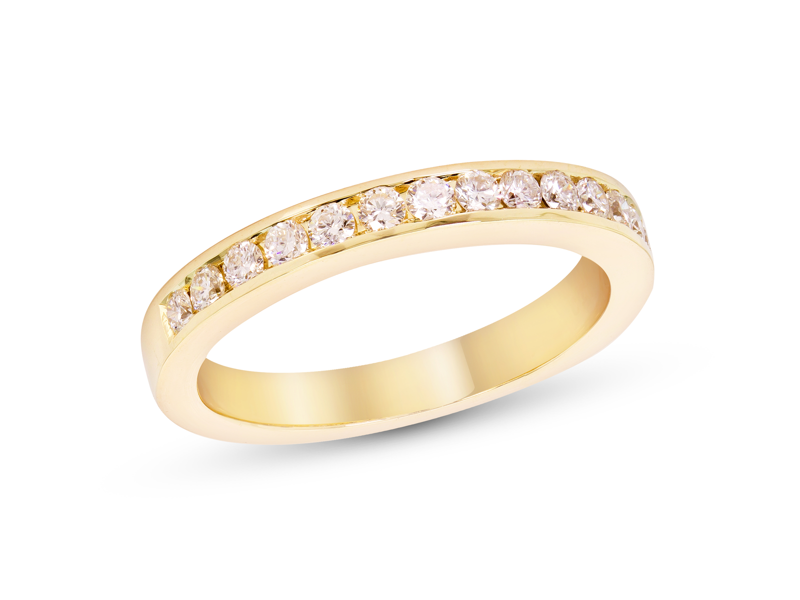
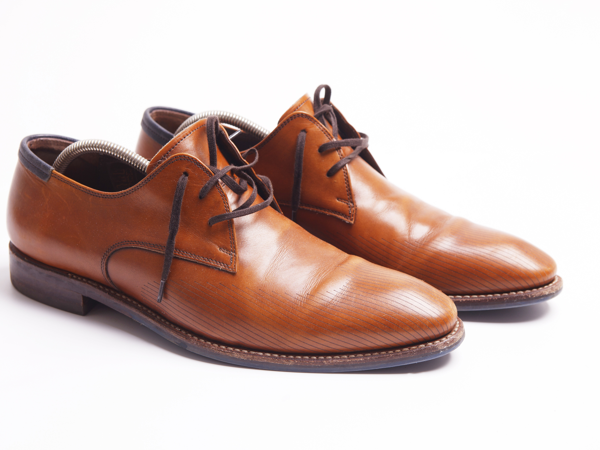
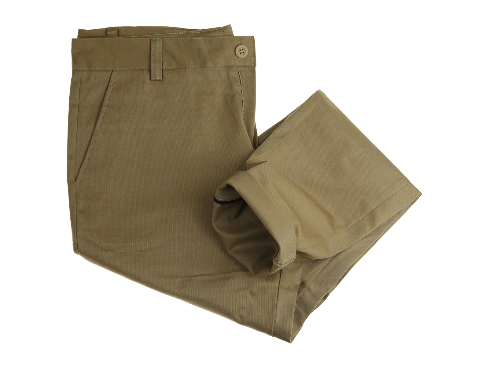

## 0-2 Sounds 

0-2 Sounds 发音

* 0-2-1 Prepare for class 上课准备
* 0-2-2 Review and practice 复习和练习

---

### 0-2-1 Prepare for class

#### 1 Listening: Multichoice Video/Audio

多项选择视频/音频

Illustration Learning：图示学习法。声音+文字+图像

<video class="ets-vp " width="640" height="360" playsinline="playsinline" preload="none" src="https://cns2.ef-cdn.com/Juno/51/64/03/v/516403/U2.mp4" style="text-size-adjust: auto !important; user-select: auto;" controls poster=""></video>

#### 2 Vocabulary: Sounds

trousers， jumper， shirt， jeans， shoes， socks， hat， boots， dress， ring， T-shirt， shorts

|          |                                                       |        |
| -------- | ----------------------------------------------------- | ------ |
| shorts   |    | 短裤   |
| T-shirt  |   | T恤衫  |
| shirt    |     | 衬衫   |
| jeans    |     | 牛仔裤 |
| jumper   |    | 毛衣   |
| dress    |     | 连衣裙 |
| scoks    |     | 袜子   |
| boots    |     | 靴子   |
| ring     |      | 戒指   |
| shoes    |     | 鞋子   |
| trousers |  | 裤子   |
| hat      |       | 帽子   |

#### 3 Speaking: Sounds

what do you wear in the summer/winter?

- I wear a dress in the summer.
- I wear a hat in the winter.
- I wear boots in the winter.
- I wear shorts and a t-shirt in the summer.
- I wear a jumper in the winter.

#### 4 Final Task: Sounds

利用图像学习发音有助于加深你的记忆。

/dʒ/	 /ɔ:/	 /ɜ:/	 /u:/	 /ɒ/	 /ɪ/	 /e/	 /aʊ/	 /æ/

### 0-1-2 Review and practice 

#### 1 Listening: Sounds Review

#### 2 Vocabulary: Sounds Review

#### 3 Final Task: Sounds Review
