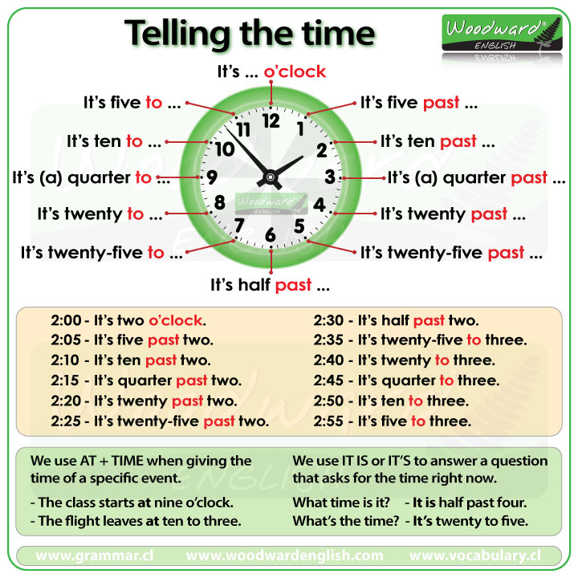

## 2-1 Times and days

* 2-1-1.  Talking about schedules
* 2-1-2. Descibing your weekend
* 2-1-3. Arranging a meeting time
* 2-1-4. Talking abut birthdays## 




### 2-1-1.  Talking about schedules

<video class="ets-vp " width="640" height="360" playsinline="playsinline" preload="none" src="https://cns2.ef-cdn.com/Juno/11/12/30/v/111230/GE_2.1.1_v2.mp4" ></video>

```
[TODD] Good morning.
[SALLY] Oh, morning!
[SALLY] What time’s the meeting?
[TODD] 9:30.
[SALLY] Phew! Not 9?
[TODD] Nope, not 9. 9:30.
[SALLY] Todd, are you never late?
[TODD] Umm, no.
[SALLY] When do you usually get to work?
[TODD] About 8 o’clock.
[SALLY] Wow. What time do you get up?
[TODD] I get up at 6, I take the train at 7:15 and I get to work at 8. Every day.
[SALLY] I get up at 8, have a cup of coffee, take the 8:30 train.
[TODD] Oh. You don’t eat breakfast?
[SALLY] Breakfast? 
[TODD] Time for the meeting. Let’s go.
```

```
INTERVIEWER:  So, tell me about your daily routine. 那么，告诉我有关你的日常安排吧。 •
PAUL:  Well, I get up at six o'clock in the morning.  At six fifteen I have a shower.  Then at six forty-five I brush my teeth.  At seven o'clock I have breakfast: eggs and toast; and a cup of black coffee.  At seven thirty I get dressed. 嗯，我早上6点起床。 我6:15洗澡。 然后，6:45刷牙。 7点吃早餐：鸡蛋和土司，还有一杯黑咖啡。 7:30更衣。 •
PAUL:  And at eight o'clock I go to work. 8点钟我去上班
```

```
INTERVIEWER:  So, what's your daily routine? 那么，你的日常安排是怎样的呢？ •
LAURA:  Well, sometimes I work at night and sometimes I work in the day. 嗯，有时我晚上上班，有时我白天上班。 •
INTERVIEWER:  Of course.  You work in a hospital. 当然。 你在医院上班。 •
LAURA:  Yes, I do. 嗯，是的。 •
INTERVIEWER:  Do you like your job? 你喜欢你的工作吗? •
LAURA:  Yes, I do.  I get up at five am.  I have a quick shower.  I brush my teeth,  get dressed, 嗯，喜欢的。 我早上5点起床。 我很快的冲澡。 刷牙， 更衣， •
LAURA:  drink a cup of coffee. 喝杯子咖啡... •
INTERVIEWER:  What do you have for breakfast? 你早餐吃什么？ •
LAURA:  Breakfast?  Yeah breakfast.  I'm a doctor.  I don't have breakfast.  I go to work. 早餐？ 早餐。 我是一个医生。 我不吃早餐。 我就去上班。
```

#### a) Expressions: Telling the time

**Asking for the time 询问时间**

* There are several ways to ask for the time:

  * **What time is it?**    

  * What's the time?    

  * **Do you have the time?**   

* If you are asking the time from someone you don't know well, it is polite to say **Excuse me** before your question.
  * **Excuse me.** What time is it? 

**Telling time 表达时间**

* Use **o'clock** for times that are on the hour. The term o'clock is both spoken and written. Times on the hour are sometimes written as numbers (5:00) but still spoken as o'clock.

  * A: What time is it? 

    B: It's 5 **o'clock**. 

  * A: What's the time? 

    B: It's 11 **o'clock.** 

  * A: Excuse me. Do you have the time?

    B: Sure. It's 12:15.

* Use **half-past** or **thirty** to say 30 minutes past the hour.

  * A: What time is it? What time is it?

    B: It's ten **thirty**.

  * A: Do you have the time?   

    B: It's **half-past** 10. 

* For all other times, say the number of minutes after the hour.

  * It's two **thirty-five.**   

  * It's nine **fifteen**. 

  * It's eight **forty-five.** 

five fifteen 5:15

six thirty 6:30

five fifty-five 5:55

three oh five 3:05

seven forty-five 7:45

nine o'clock 9:00

four oh five 4:05

two fifty-five 2:55

one thirty-five 1:35

eleven ten 11:10

#### b) Vocabulary: Daily activities

have a meeting ；take a train；go home；give a presentation；have lunch；get to work；get to school；check emails；study English

#### c) Expressions: Talking about routines

**Talking about routines 谈论日常工作**

* To ask someone about their daily routines, use the question word **when**. Use the preposition **at** to state the time of the event.

  * A: **When** do you get up? 

    B: I get up **at** 6:30.  

  * A: **When** is the meeting?           

    B: It's **at** 3 o'clock.  

  * He comes to work every day **at** 7.｜ I have a meeting every day **at** 9 o'clock.

* You can also ask about daily routines using the expression **what time**.

  * A: **What time** do you get up?

    B: I get up **at** 6:30.          

  * A: **What time** is the meeting?

    B: It's **at** 3 o'clock.  

**'a.m.' and 'p.m.'** ：To make clear what time you do something, use **a.m**. after times from midnight to noon, and use **p.m**. after times from noon to midnight.

* I go running at 7 **a.m**.                
* I eat lunch at 1 **p.m**.  

**'Usually' and 'sometimes'**：Use the word **usually** to talk about something you do most of the time. Use the word **sometimes** to talk about something you do some of the time.

* I **usually** get to work at 8 o'clock.          
* I **sometimes** get home at 8 p.m.

**'Morning,' 'afternoon,' 'evening' and 'night'**： Another way to make the time clear is to use the phrase**s in the morning, in the afternoon, in the evening** and **at night.**

* A: When do you go running in the park?  

  B: I go **at** 7 **in the morning.**   

* I go running **at** night.

* I play ball with my son **in** the evening.

* Culture note: Most countries use the 24-hour clock, the international standard. The time **8:30 p.m.**, for example, is **20:30**. The US and a few other countries commonly use the 12-hour clock.

**'Midnight' and 'noon'**： There are two words for 12 o'clock. For 12 o'clock at night, use **midnight**. For 12 o'clock in the day, use **noon**. Use the preposition at with these two words.

* A: When's the meeting?             

  B: It's **at noon**.  ｜The meeting is **at** noon.

* A: What time do you go to bed?          

  B: I go to bed **at midnight.**  


Excuse me, do you have the time?

What time is it?

When do you get up?

I take a train in the evening.

What's the time?

The meeting is at one forty-five.

---

>  My name is Lee. I live in China. I'm a manager in an office. I have a very busy life. I get up at 6 a.m. I take a train at 6:30. I get to work at 7:15. I check my emails. I always have a lot of meetings. I usually have lunch at noon. I leave the office at 7 p.m. I get home at 7:30.

```
**What time does Lee get up?**

**When does Lee take the train?**

**When does he usually have lunch?**

**What time does he get home?**
```

#### d) Final Task: Talking about schedules

You are with a colleague. When you see a blank, talk about your routine or give the time.Listen carefully and then record the correct answer.

```
A: Do you like your job?
B: Yes, but I'm very busy.
A: when do you get to work?
B: I get to work at _____.
A: wow, and when do you go home?
B: I go home at _____.
A: oh really ,what time is it now?
B: The time? It's _____.
A: oh, I have a meeting at 1 o'clock, bye
B: See you later!
```

### 2-1-2. Descibing your weekend

<video class="ets-vp " width="640" height="360" playsinline="playsinline" preload="none" src="https://cns2.ef-cdn.com/Juno/15/56/69/v/155669/GE_2.1.2.1.1.mp4" style="text-size-adjust: auto !important; user-select: auto;"></video>

```
NTERVIEWER:  Do you like your job? 
LAURA:  Yes!  I do!  I love my job. 
INTERVIEWER:  How about in the evening, or at the weekend?  Do you have free time? 晚上或周末怎么安排呢？ 你有空吗？ 
LAURA:  Monday to Friday?  No. 周一到周五？ 没有。 •
INTERVIEWER:  What time do you get home in the evening? 你晚上什么时候到家呢？ •
LAURA:  Sometimes six o'clock, sometimes twelve.  And what do you do in the evening?  I surf the Internet,  talk on the phone.  I have dinner. 有时6点，有时12点。 你晚上一般做什么呢？ 我上网。 打电话。 我吃晚饭。 •
INTERVIEWER:  And what do you do at the weekend? 那你周末干什么呢？ •
LAURA:  At the weekend I sleep. 周末我睡觉
```

#### a) Vocabulary: 

##### i) Days of the week

Here are the seven days of the week. For most people, the work week begins on Monday. Saturday and Sunday are the weekend.

Monday  Tuesday  Wednesday  Thursday    Friday   Saturday     Sunday 

**Prepositions of time**: 时间介词

* To talk about what you do on a day, use the preposition **on + the day.**
  *  **On** Saturday, I sleep.    

* To talk about a work week, use the prepositions **from** and **to**.
  * I work in an office **from** Monday **to** Friday. 

* In British English, people use the preposition **at + the weekend** to talk about the weekend. In American English, people use the preposition **on + the weekend** or **on + weekends.**
  * **On weekends**, I go to a restaurant.  
  * **At the weekend,** I go to a restaurant.   
  * What are you doing **on the weekend?** 

* On Friday, at the end of the day, when people in an office are leaving for the weekend, many people say:
  * Have a nice weekend!            

 

On Saturday, I usually get up at 10 or 11 a.m.

The meeting is at 3 p.m.

What do you do  on the weekend?

I work from Monday to Friday.

I get up at six in the morning.

In  the evening, I usually watch TV.

##### ii) Fun activities

sleep, go swimming, play tennis, go to a restaurant, talk on the phone, play basketball, meet friends, surf the internet, ride a bike, go to the movies

> A: Hi, Jenny. How are you doing?
> B: Great. So what are you doing in the park, Harry?
> A: Oh. I come here every weekend and I go running in the mornings sometimes I ride my bicycle. 
> B: That's great, I really like the park too. I play basketball here on Saturday morning whit my friends. 
> A: Really?
> B: Yeah.And on Sunday afternoons. I have tennes class, 
> A: Cool 
> B: Yeah ,well see you monday
> A: See you Monday.

What do you usually do on the weekend?

I usually get up late on Saturday.

What do you do in the afternoon?

On Saturday afternoon, I sometimes play tennis.

In the evening, I usually watch TV.

Sometimes I meet friends or go to the movie

See you on Monday!

Have a nice weekend.

**Where are Jenny and Harry?** 

In a park.

**What does Harry do in the park?**

He goes running

**What does Jenny do on Saturday morning?**

she plays basketball

**What does Jenny do on Sunday?**

she goes to a tennis class

#### b) Final Task: Describing your weekend

It's Friday, and your colleague is looking forward to the weekend. Listen and record the correct response. When you see a blank, give true information about yourself.

<video class="ets-vp " width="640" height="360" playsinline="playsinline" preload="none" src="https://cns2.ef-cdn.com/Juno/28/58/3/v/28583/VR_B.1.3.mp4" style="text-size-adjust: auto !important; user-select: auto;"></video>


```
A: It's Friday. I love Fridays.
B: What do you usually do on the weekend?
A: Well, On Saturdays I usally get up at ten or eleven in the morning. what about you, what time do you get up?
B: I usually get up at _____.
A: What do you do after that?
B: In the morning, I _____.
A: Yeah, I do that sometimes.
B: What do you do in the afternoon?
A: In the afternoon I meet friends or go to the movies, how about you?
B: n the afternoon, I usually _____.
A: On Sunday, I sleep, sometimes I do nothing all day.
B: On Sunday, I _____.
A: Here we go. five, four, there, two, one. It's the weekend. See you on Monday.
B: Have a nice weekend.
```

### 2-1-3. Arranging a meeting time 

<video class="ets-vp " width="640" height="360" playsinline="playsinline" preload="none" src="https://cns2.ef-cdn.com/Juno/19/85/9/v/19859/0b.1%20Scene%203_v2.mp4" style="text-size-adjust: auto !important; user-select: auto;"></video>

```
INTERVIEWER:  So, what do you do? 那么，你是做什么工作的呢？ •
PAUL:  I'm a manager in a paper company. 我是一家纸厂的经理。 •
INTERVIEWER:  A paper company? 纸厂？ •
PAUL:  Yes. 是的。 •
INTERVIEWER:  Could you tell me about your day at work. 你能跟我说说你工作一天的情况吗？ •
PAUL:  Well, I arrive at the office at eight thirty.  I check my emails.  And in the afternoon, I have meetings.  Then I check my emails again. 嗯，我8:30到达办公室。 我查看邮件。 下午，会开几个会。 然后我再查邮件。 •
INTERVIEWER:  Do you like your job? 你喜欢你的工作吗？ •
PAUL:  Well. it's ah. no. 嗯...不
```

#### a) Vocabulary: Work vocabulary

have a meeting

read a report

check emails

give a presentation

make a phone call

write a note

talk to colleagues

take a coffee break

#### b) Grammar: Requests with 'can'

'Can' and 'can't' for requests **用于表达请求的 \**Can\** 和 \**can't\****

Use the word can at the beginning of a sentence to make an informal request. Use the short answe**r Yes, I can** to give a positive response. Use the short answer No, I can't to give a negative response. 

|                      | Positive:       | Negative:                                   |
| -------------------- | --------------- | ------------------------------------------- |
| **Can** you help me? | **Yes, I can.** | No, **I can't.**<br>I'm sorry, but I can't. |

For longer, more detailed answers, use the words **can** and **can't** with the base form of the verb.

* I **can meet** at 3 o'clock.                    
* I **can't eat** lunch with you. 

When you refuse a request, you should use the phrase **I'm sorry, but** to apologize.

* A: Can you come to a meeting at 4:15?  

  B: **I'm sorry, but** I can't.  ｜ I'm sorry, but I can't meet today.

---


> SALLY: Brian, can you come to a meeting at 10 o'clock?
> BRIAN: I'm really sorry, Sally, but I can't. I have another meeting at 10.
> SALLY: That's too bad. How about 11 o'clock?
> BRIAN: I'm not free at 11.
> SALLY: And I'm not free at noon. I'm having lunch with Mary.
> BRIAN: How about 2 this afternoon?
> SALLY: That's good. I can do 2.
> BRIAN: Great! See you at 2 o'clock.

**What does Brian have at 10 o'clock?**

**Can Brian meet Sally at 11? **NO,he can;t

**What is Sally doing at noon?** She's having lunch

**What time can Brian and Sally meet?** 2

> Can we meet at 1 this afternoon?
> I'm sorry, but I can't.
> Well, what about 3?
> I'm not free at 3.
> Well, when are you free?
> I'm free at 4.
> OK. Let's meet at 4 o'clock.

#### c) Final Task: Arranging a time for a meeting

Your colleague Helen is trying to schedule a meeting with you. You are only free on Thursday afternoon.Listen and record the correct response.

```
A: Hi can we meet on Tuesday to talk about the big presentation?
B: I'm sorry, but I can't. I'm busy.
A: Well how about Wednesday, are you free on Wednesday Monday?
B: No, I'm not, but I'm free on Thursday.
A: Thursday? That's good, how about ten in the morning?
B: I can only meet in the afternoon.
A: OK, Thursday afternoon, how's 2pm?
B: Great! See you on Thursday at 2!
```

### 2-1-4. Talking abut birthdays

<video class="ets-vp " width="640" height="360" playsinline="playsinline" preload="none" src="https://cns2.ef-cdn.com/Juno/15/56/6/v/15566/1.6%20Scene%204.mp4" style="text-size-adjust: auto !important; user-select: auto;"></video>

```
[NANCY]: So, Bob's birthday os on the 21st of June.
[NANCY]: Emma's birthday is on October the 25th.
[NANCY]: The 3rd of December - that's our son Eric's birthday.
[NANCY]: And my birthday is on the of March.
```

#### a) Vocabulary: Months of the year

**Months of the year**: Look at the months of the year. Click on the audio buttons to listen to them.

*  January.  February  March   April   May   June   July   

* August   September    October   November    December   

When talking about an event that will happen in a specific month, use the preposition in.

* The big meeting is in February.     
* My birthday is in March.   

#### b) Expressions

##### i) Saying dates

**Ordinal numbers*序数**: Dates are spoken as ordinal numbers. Look at the numbers you know and their corresponding ordinal numbers. Notice that most of them end in th.  After twenty, just add the appropriate ordinal number from one to ten.

one - first      two - second    three - third    four - fourth    five - fifth    six - sixth   seven - seventh 

eight - eighth   nine - ninth     ten - tenth   eleven - eleventh   twelve - twelfth    thirteen - thirteenth   

fourteen - fourteenth    fifteen - fifteenth.     sixteen - sixteenth       seventeen - seventeenth

eighteen - eighteenth       nineteen - nineteenth         twenty - twentieth  twenty-two - twenty-second              

 twenty-six - twenty-sixth             thirty - thirtieth.      thirty-one - thirty-first

These numbers can be abbreviated. Look at the examples:

* first - 1st                                       
* second - 2nd
* third - 3rd             
* fourteenth - 14th
* thirty-first - 31st 

**Saying dates表达日期**: 

* There are several ways of saying dates. In the United States, people usually say the month first and then the day. Dates are almost always written with the short form – for example, **July 17** or July 17th, not **July seventeenth.**

  * July 2nd                                        

  * February 10 

  * October 21st    


* In the United Kingdom, people say the dates using the words **the** and **of** to highlight the day and month.

  * the 31st of January                    

  * the 12th of March  

  * the 7th of June


* With specific dates, use the preposition **on**.

  * The meeting is on April 19th.   


  * The presentation is on September 13.    


##### ii) Talking about a birthday

**Birthdays**

In English-speaking countries, people often celebrate birthdays by giving presents and having a party. The celebration can include a cake, sometimes with candles that equal the age of the person having the birthday. If you know it is someone's birthday, say:

* Happy birthday!                                

You generally do not have to give someone a present unless you are invited to their birthday party. People wrap birthday presents in colorful paper. Some older people may be sensitive about their age, so wait to be told how old they are. With younger people, this is not usually a problem.

Use the following question to ask someone when their birthday is:

* A: When's your birthday?                    

  B: It's September 21st. 

-----

* play computer games
* get presents
* eat cake
* listen to music
* meet friends
* go out
* sing
* Dance

 When is your birthday?

It's May 21st.

What's that?

It's a birthday present for my son.

What are you doing for his birthday?

We're going to a restaurant.

#### c) Final Task: Talking about birthdays

You bump into a friend at the bus stop. She's holding a gift. Ask her about it.

Listen and record the correct response. When you see a blank, give true information about yourself.

```
A: Hi, how's it going?
B: Hi! I'm good. What's that?
A: It's birthday present for my son.
B: What is it?
A: It's a computer game. He loves computer games.
B: How old is your son?
A: He's 11
B: What are you doing for his birthday?
A: Well, He loves pizza. so we're going to his favorite Italian restaurant then we're going to watch a movie.
B: Nice. When is your birthday?
A: It's on July 7th, how about you?
B: My birthday's on _____.
```

What are you doing for his birthday?


================================================================================

```
NANCY:  April?  It's not April.  It's June. 四月？ 不是四月。 是六月。 •EMMA:  June twentieth. 6月12日。 •NANCY:  Oh no.  Tomorrow is the twenty-first of June. 哦，不。 明天是6月21。 •EMMA:  Dad's birthday! 爸爸的生日！ •NANCY:  Emma. Emma。 •EMMA:  OK, OK.  I'll buy him a present. 好的，好的。 我会给他买件礼物。 •NANCY:  Thanks, its just.  I know.  You're really busy.  Don't worry.  I can go shopping this afternoon. •谢谢，只是。 我知道 。 你真忙。   别着急。 我今天下午可以去购物
```

```
EMMA:  I like buying presents for my friends. but, for my father?  What does he like?  I don't know.  I know what he doesn't like.  He doesn't like gardening. 我喜欢给我的朋友买  礼物...但是，给我父亲？ 他喜欢 什么呢？ 我不知道。 我知道他不喜欢什么。 他不喜欢园艺。 •EMMA:  And he doesn't like cooking. 他不喜欢烹饪。 •BOB:  Hello! 你好！ •EMMA:  And he really doesn't like talking on the phone. 还有，他真的不喜欢 打电话聊  天。•BOB:  Oh hello Eric son, I'll just get your mother.  Nancy!  Nancy! 哦，Eric，儿子，我刚收到你妈妈的礼物。 Nancy！ Nancy！ •EMMA:  But he does like fishing.  That's it.  Fishing! 但是他喜欢钓鱼。 就是它了。 钓鱼！ 
```

```
BOB:  Look at that.  I love my birthday presents.  Thanks very much.  Thanks darling.  Emma, play us a song on the guitar. •看着那个。 我喜欢我的生日礼物。 非常谢谢。 谢谢亲爱的。 Emma，用吉 他给我们弹首歌  吧。 •EMMA:  Dad, I can't play the guitar. 爸爸，我不会弹吉 他。 •BOB:  Yes you can.  Anyway, it's my birthday. 是的，你能的。 不管怎样，今天是我生日。 •EMMA:  OK. 好的。 •BOB:  Bravo!  She can play the guitar. 好极了！ 她会弹吉他。
```


```
MICHELLE:  I love birthdays!  My birthday is in March.  Every year, for my birthday, I have a party.  I invite my friends. 我爱过生日！ 我的生日在三月。 每年，我生日时，都会有一个派对。 我会邀请我的朋友们。 •
LAURA, JAMES & PAUL:  Happy birthday! 生日快乐！ •
MICHELLE:  Sometimes we eat out but we usually have a party at home.  We dance, sing and we eat cake. 有时我们出去吃，但是我们通常在家里开派对。 我们跳舞，唱歌，吃蛋糕。 •
LAURA, JAMES & PAUL:  Three!  Two!  One! 3！ 2！ 1！ 

```

```
JAMES:  I hate birthdays.  Presents?  Presents?  Well. I usually get socks.  Oh and I sometimes get pens. 我讨厌过生日。 礼物？ 礼物？ 嗯...我通常收到袜子。 哦，我有时收到钢笔。 •
JAMES:  My birthday's in July.  It's always hot.  I never go out.  I never have a party.  I'm thirty four years old. 我的生日在7月。 天总是很热。 我从不出去。 我从没有开过派对。 我34岁了。 •
JAMES:  I don't like birthdays. 我不喜欢过生日。
```

```
MICHELLE:  Presents!  Perfume from Laura and Ken.  A camera from James.  And from Paul, a watch.  And from my mum and dad. 礼物！ Laura和Ken送的香水。 James送的照相机。Paul送的一只手表。 我妈妈和爸爸送的
```

```
JAMES:  So.  Yes.  I'm thirty four years old.  thirty four!  I don't like birthdays. 那么。 是的。 我34岁了。 34岁！ 我不喜欢生日。 •
JAMES:  What do I usually do?  I go to the office.  I work and then I go home.  I don't eat cake.  I don't dance. 我通常做什么？ 我去办公室。 我上班，然后回家。 我不吃蛋糕。 我不跳舞。 •
PAUL:  Come on James. 得了吧James。 •
JAMES:  And I don't sing.  Birthdays!  Well?  What do you do? 我也不唱歌。 生日！ 嗯？ 那你做什么呢？
```


```
STUART:  I'm so sorry.  OK.  No, no, I promise.  OK.  Alright. 我很抱歉。 好的。 不，不，我承诺。 好的。 好的。 •STUART:  Right.  I will write that down.  OK.  OK.  Right. 对的。 我会写下来。 好的。 好的。 对的。 •STUART:  Saturday, February twenty eighth.  Birthday.  Elizabeth.  A present.  Yeah. 周六，2月28日。 生日。 Elizabeth。 礼物。 是的。 •STUART:  Chocolates or flowers?  OK.  Alright.  Lunch at twelve thirty.  Linderman at six. 巧克力还是花？ 好的。 好的。 12:30的午餐。 6:00到Linderman。 •STUART:  OK.  The box.  Yep, oh yes, the box!  The box.  Right. 好的。 盒子。 是的，哦，是的，盒子！ 盒子。 对的。 •STUART:  OK.  OK, thank you.  Bye.  The box. 好的。 好的，谢谢你。 再见。 盒子。 
```

```
MR LINDERMAN:  Happy Birthday Elizabeth. Elizabeth，生日快乐。 •ELIZABETH:  Twenty five.  Fifteen. 25. 15. •MR LINDERMAN:  Twenty.  Happy Birthday. 20. 生日快乐。 •ELIZABETH:  Thank you. 谢谢你。
```

* 

----

| Time                                                      |      |
| --------------------------------------------------------- | ---- |
| second \| minute \| hour                                  |      |
| two o'clock                                               |      |
| two fifteen /a quarter after   two                        |      |
| two thirty/half past two                                  | 2:30 |
| two forty-five/a quarter to three                         | 2:45 |
| two-oh-five                                               | 2:05 |
| two twenty/twenty after two                               | 2:20 |
| two forty/twenty to three                                 | 2:40 |
| two fifty-five/five to three                              | 2:25 |
| two A.M.                                                  |      |
| two P.M.                                                  |      |
| noon/twelve noon                                          |      |
| midnight/twelve midnight                                  |      |
| morning\|   noon \|afternoon\| evening\| night \|midnight |      |
|                                                           |      |
| early late                                                |      |

| time   zones         |
| -------------------- |
| hawaii-Aleutian time |
| alaska time          |
| pacific time         |
| mountain time        |
| central tine         |
| eastern time         |
| atlantic time        |
| newfoundland time    |
| daylight saving time |
| standard time        |

| the   calendar      |
| ------------------- |
| year                |
| month               |
| week                |
| day                 |
| weekend \| weekdays |
| date                |
| today               |

| days of  the week     |
| --------------------- |
| what day is it?       |
| what day is it today? |
| (every/on) Sunday     |
| (every/on) Monday     |
| (every/on) Tuesday    |
| (every/on) Wednesday  |
| (every/on) Thursday   |
| (every/on) Friday     |
| (on) Saturday         |
| a week tommorrow      |
| a week on Tuesday     |

| time   expressions and seasons |
| ------------------------------ |
| yesterday                      |
| today                          |
| tomorrow                       |
|                                |
| morning                        |
| afternoon                      |
| evening                        |
| night                          |
|                                |
| yesterday monring              |
| yestorday afternoon            |
| yesterday evening              |
| last night                     |
|                                |
| this morning                   |
| this afternoon                 |
| this evening                   |
| tonight                        |
|                                |
| tomorrow morning               |
| tomorrow afternoon             |
| tomorrow evening               |
| tomorrow night                 |
|                                |
| last week                      |
| this week                      |
| next week                      |
|                                |
| once a week                    |
| twice a week                   |
| three times a week             |
| every day                      |

| the   important day               |
| --------------------------------- |
| january 3,2012                    |
| january third,two thousand twelve |
| birthday                          |
| anniversary                       |
| legal holiday                     |
| religious holiday                 |
| appointment                       |
| vacation                          |

