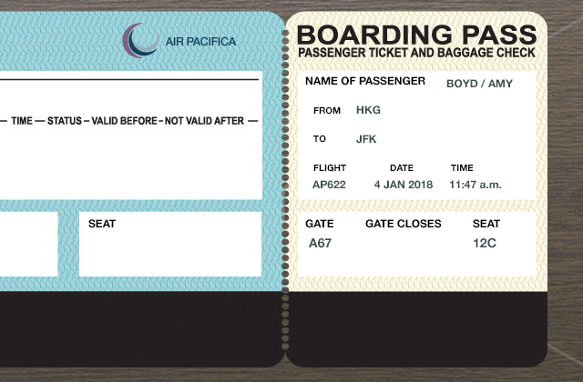

## 5-1 Travel

5-1     Travel  旅行

5-1-1 Talking about flight arrangements 谈论航班安排

5-1-2 Checking in for a fight 办理登记

5-1-3 Getting to your hotel  前往您入住的酒店

5-1-4 Letting someone know you've arrived 告知他人您已抵达

---

### 5-1-1. Talking about flight arrangements 

<video class="ets-vp " width="640" height="360" playsinline="playsinline" poster="https://cns2.ef-cdn.com/Juno/12/91/21/v/129121/GE_5.1.1.1.1.jpg" preload="none" src="https://cns2.ef-cdn.com/Juno/12/89/08/v/128908/GE_5.1.1_v2.mp4" style="text-size-adjust: auto !important; user-select: auto;"></video>

```
A: Passport, ticket, uh, don't need a visa for Sweden.
B: Are you going somewhere?
A: Joan called last night, around 3 o'clock.
B: in the morning?
A: Yeah, I'm flying to, uh, Stockholm. There's a... She needs help with a client. I packed this morning.
A: Stockholm? That's a long trip. Looks like you're in a hurry.
B: My flight leaves in three hours, and I haven't printed my boarding pass, called a taxi or ...
A: Todd, let me help. How about you print your boarding pass? I'll call a taxi for you. What time's your flight?
B: It's 5:15
A: You have plenty of time. What's the atrline?
B: It's, uh, it's Western Airlines. I leave from, uh, the international terminal.
A: Okay, Western. No problem. Yes. I need a taxi at 3 p.m.
```
#### a) Vocabulary: Travel Vocabulary
* flight: We're booked on the same flight.
* passport: a South African passport. Everyone needs a passport for international travel.
* boarding pass: Please show your boarding pass. Do you already have your boarding pass? 
* terminal: A second terminal was opened in 2008. Does your flight leave from the domestic or international terminal ?
* luggage: You stay there with the luggage while I find a cab.
* ticket: free ticket to the show. I usually buy my airline tickets online.
* airline: international airline. Which airline do you fly on most frequently?
* visa: to apply for a visa. I don't need a visa to enter that country.
* airport

---

* Does your flight leave from the domestic or international **terminal** ?
* Do you already have your boarding **pass** ?
* I usually buy my airline **tickets** online.
* I don't need a **visa** to enter that country.
* Which **airline** do you fly on most frequently?
* Everyone needs a **passport** for international travel.

#### b) Grammar: Present perfect

 **现在完成时**

* **检查某人是否做了某事** Checking is someone has done something 
  
    * 使用现在完成时，谈论对现在有特定影响的一个过去的动作或事件，例如，检查某人是否做了某事。
        * **Have you packed** your bags?	您收拾好了吗？
        * **Have you printed** your boarding pass?	您打印登机牌了吗？
    
    
    * 构成现在完成时疑问句的方法：**have + subject + 过去分词**。
      * **Have you brought** your passport?	您带护照了吗？
    
    * 以下是一些有用的过去分词。拿它们和现在时及过去式对比。
    
      * pack – packed – **packed**
    
      * print – printed – **printed**
    
      * book – booked – **booked**
      * bring – brought – **brought**
      * lose – lost – **lost**
    
* **回答问题**Responding to questions ： 如果有人问您是否做了某事，您可以使用像这样简短的短语回答：

    * A: Have you printed your boarding pass? 您打印登机牌了吗？

      B: **Yes, I have.** 是的，打印了。

    * A: Have you packed your bags? 您收拾好了吗？

      B: **No, not yet**. 没，还没呢。

* **表达您做了什么或者没做什么**Saying what you have or haven't done 

    * 要表达您做了什么，用类似这样的短语：
      * I **have booked** a taxi.	我订了出租车。


    * 在讲话中，代名词和动词通常缩写。
      * I**'ve booked** a taxi.	我订了出租车。


    * 要告诉某人您没做什么，在 **have** 后面加 **n't**。
    
      * I **haven't** printed my boarding pass.	我没有打印我的登机牌。
    
      * I **haven't** checked in yet.	我还没有办理值机。

---

Questions: 

* **Have you printed your boarding pass?**
* **Have you booked a taxi?**

* **I haven't printed my boarding pass.**

* **Have you packed your bag?** Yes, I have

* **What time is the taxi coming?**  At 5:30.

* **Did you call the airport?** Yes, I did

* **Have you printed your boarding pass?**. No, not yet

* **What did you do this morning?** I packed my bags

---

* Have you booked a taxi for tomorrow? 您订了明天的出租车了吗？

* Yes, I have. 是的，我订了。

* Have you printed your boarding pass? 您打印登机牌了吗？

* No, not yet. 没，还没有。

* I've bought some cheap tickets. 我买到了几张便宜票。

* I haven't packed my bags. 我没收拾好东西。

* I haven't checked in yet. 我还没有办理值机。

#### c) Expressions: Asking for and giving flight information

**询问和提供航班信息** Asking for and giving flight information. ： 使用类似表达谈论航班信息。在本例中，一个人从芝加哥飞往巴黎。

* A: When are you leaving for Chicago? 你什么时候离开？
  B: On the 23rd.	 在23日。

* A: When are you returning? 你什么时候返回？
  B: On Friday the 31st.	在31号，星期五。	 

* A: What time's your flight? 航班几点起飞？
  B: It's at 7:38 a.m.	早上 7:38 分。	 

* A: What's the airline? 是哪家航空公司？
  B: (I'm flying with) Air Pacifica. | It's Air Pacifica.	太平洋航空。

* A: When do you arrive in Paris? 你什么时候到达巴黎？
  B: At 11:42 p.m.	 下午11:42 	 

* A: Which airport do you fly out of? 你要在哪个机场起飞？
  B: (I'm flying in to ) O'Hare.	 奥黑尔机场。 	 	 

* A: Which airport do you fly in to? 你要飞抵哪个机场？
  A: Which airport are you flying in to?
  B: I fly in to De Gaulle.	 我飞往戴高乐机场。

* A: Have you booked a tocket
  B: Yes, I have.

* A: Which airline is she talking?
  B: Southern.

* A: When does she fly in to Sydney?
  B: 6:25

---

Questions: 

* **What time's your flight?**

* **When are you leaving?**

* **Have you booked a taxi?**

* **What's the airline?**

* **What airport are you flying in to?**

---

Questions: 

* **When is she leaving?**

* **When is she returning?**

* **Which airline is she taking?**

* **Which airport does she fly out of?**

* **When does she fly in to Sydney?**

---

* When are you leaving for Mumbai? 你什么时候动身去孟买？
* On the 15th, returning on the 23rd. 15 号去，23 号返回。
* What time's your flight? 航班几点起飞？
* It's at 9:45 a.m. 早上九点四十五分。
* What's the airline? 是哪家航空公司？
* It's Southern Air. 南方航空。
* Which airport are you flying in to? 您要飞往哪一个机场？
* I'm flying in to Shanghai. 我要飞往上海。

#### d) Final Task: Talking about flight arrangements

你购买了一张从中国北京到阿根廷布宜诺斯艾利斯的机票。你的同事对你的航班有些疑问

```
A: So, are you ready for your trip?
B: Yes. I've got my ticket, and I've packed my bag.
A: Great! When are you leaving?
B: The 17th, returning on the 23rd.
A: 17th to the 23rd. I got it. What time is your flight?
B: It's at ten-thirty.
A: What's the airline?
B: I'm flying with Blue Plane Airlines.
A: Nice. I love Blue Plane. When do you arriving at Buenos Aires
B: At eleven p.m.
A: Well. Have a great trip.
B: Thank you.
```

### 5-1-2. Checking in for a fight 

<video class="ets-vp " width="640" height="360" playsinline="playsinline" poster="https://cns2.ef-cdn.com/Juno/12/81/01/v/128101/GE_5.1.2.1.1.jpg" preload="none" src="https://cns2.ef-cdn.com/Juno/12/59/81/v/125981/GE_5.1.2_v2.mp4" style="text-size-adjust: auto !important; user-select: auto;"></video>

```
A: Good afternoon. Where are you flying today?
B: I'm flying to Stockholm.
A: May I see your passport, please?
B: Yes. Here you are. De you need to see my boarding pass?
A: Uh, no. I don't. Unfortunately. your flight has been delayed. It's now scheduled to depart at 6 p.m.
B: Oh, well. That's not too bad.
A: I'm sorry for any inconvenience.
B: That's OK. | It's no problem.
A: Are you checking any bags today?今天你要托运行李吗？| How many bags to check?
B: Yes. I have one bag to check and one bag to carry on.
A: Have you left your bags unattended at any time?你有把旅行包丢在一边不管吗？| Were your bags unattended?
B: No. I've always had my bags with me. | No, I had them with me.
A: Okay. That's good. Right now you have a middle seat. Would you prefer a window seat or an asile seat?
B: Umm, an aisle seat, please.
A: Okay. Here's your new boarding pass and your baggage claim.
B: Thanks.
A: Go thourgh security, and your flight to Stockholm will depart from Gate B25. The flight boards at 5:30.
B: Gate B25, Okay. Thank you.
```

#### a) Expressions: Checking in at an airport

在机场办理登机

* Here's my ticket and passport. 这是我的机票和护照。
* My flight has been delayed. 我的航班推迟了。
* I have one bag to check and one to carry on. 我有一件行李托运，一件带上飞机。
* I've always had my bags with me. 我的包一直随身携带。
* I'd like an aisle seat. 我想要一个靠走廊的座位。
* My flight departs from Gate C2. 我的航班从 C2 登机口出发。

---


- How many bags to check?

  I've got two to check.
- Where are you flying?

  I'm flying to Denver.
- Were your bags unattended?

  No, I had them with me.
- An aisle or window seat?

  A window seat, please.
- You depart from Gate A7.

  Gate A7? Thanks.
- I'm sorry for the delay.

  It's no problem.

#### b) Reading: Reading a boarding pass

- Passenger name: AMY BOYD
- Departure: 11:47 A.M. 4 JAN 2018
- Flight: AIR PACIFICA 622
- Gate: A67
- To: JFK
- SEAT: 12C



Questions: 

* **What's the name of the airline?**

* **What airport is the plane flying out of?**

* **What airport is the plane flying in to?**

* **Whose boarding pass is this?**

* **Which gate is the flight leaving from?**

* **What time is she leaving?**

* **What's the seat number?**

#### c) Final task: Checking in for a flight

你在办理到纽约的航班的登机手续。跟航空公司的代理交谈。 

<video class="ets-vp " width="640" height="360" playsinline="playsinline" preload="none" src="https://cns2.ef-cdn.com/Juno/15/56/67/v/155667/GE_5.1.2.3.1_VRP.mp4" style="text-size-adjust: auto !important; user-select: auto;"></video>

```
A: Good afternoon. Where are you flying to today?
B: I'm flying to New York.
A: May I see your ticket and passport, please?
B: Yes, here they are.
A: Unfortunately, your flight has been delayed. It's now scheduled to depart at 9 p.m. today.
B: Nine p.m.? That's not too bad.
A: How many bags are you checking?
B: I have one bag to check and one bag to carry on.
A: Did you leave your bags unattended?
B: No. I've always had them with me.
A: Would you like a window seat or an asile seat?
B: I'd like _____.
A: All right. Here is your boarding pass and baggage claim. Go thourgh security, and your flight to NewYork will depart from Gate E24. The flight boards at 8:15.
B: Gate E24. OK. Thank you.
```
### 5-1-3. Getting to your hotel 

<video class="ets-vp " width="640" height="360" playsinline="playsinline" poster="https://cns2.ef-cdn.com/Juno/12/81/02/v/128102/GE_5.1.3.3.1.jpg" preload="none" src="https://cns2.ef-cdn.com/Juno/12/56/20/v/125620/GE_5.1.3_v3.mp4" style="text-size-adjust: auto !important; user-select: auto;"></video>

```
A: Excuse me. Did you help me? 
B: Sure, Whay do you need?
A: How do I get downtown? I'm staying in a hotel there.
B: Uh, well, you basically have three options. 
A: OK.
B: You can take a taxi. There are also buses to downtown. Or you could take the express train.
A: Would a taxi be the fastest?
B: Umm, not always. The traffic's usually pretty bad at this time.
A: Oh. So what do you suggest?
B: Umm, what's the name of your hotel?
A: It's the ... It's the Royal Stockholm Hotel.
B: Can I see the address?
A: Certainly
B: Okay, this is going to be easy. Your hotel is near Stockholm Central Station, so the best choice for you is the express train.
A: The express train.
B: Yeah, It's a little expensive, but it's really fast. Just get off at Central Station.
A: Where is the express train from here?
B: Go straight this way. See the woman with the big hat?
A: Yes.
B: Turn left there. The station is really close.
A: THank you ver much.
B: My pleasure.
```

#### a) Vocabulary: Airport transportation
* express train 特快列车: We traveled by express train to New York. 
* rental car  租车: I got a rental car at the airport.We hired a rental car.
* taxi: a taxi driver/ride
* limousine /ˌlɪməˈziːn/: A large luxurious vehicle that often times has a division separating the driver and passenger compartments. 大型豪华轿车
* subway: the New York subway
* shuttle 穿梭班机﹑ 公共汽车: a shuttle service between London and Edinburgh. 
#### b) Grammar: 'have to' for necessary or obligation
**'Have to'表达必要和义务** Have to for necessity or obligation 

* 你可以使用**have to +动词**表达你需要做的事情。

    * Danielle's flight leaves in an hour. She'll have to catch the express train.	Danielle 的航班一小时后起飞。她必须赶乘特快列车。
    * The company gave me a limousine, so I didn't have to take the shuttle.	公司给我派了一辆豪华汽车，所以我不必乘坐机场大巴。
* 你也可以使用**have to +动词**表达你有义务要做的事。
  
    * A: Did you have to drive Ted to the airport? 你必须开车送 Ted 去机场吗？
    * B: Yes, I did. He drove me last time.	是的，我得送他。上次他开车送的我。

---

> To: Mr.M@Silvin.com
> From: karlx@ggc.net
> Subject: Visiting Budapest
>
> Hi, Martin!
>
> I **have to fly**  to Budapest on Thursday. After I arrive, I have to get to Vaci Utca and then find Parliament. I also **want to eat** at an interesting restaurant, but it **doesn't have to be** fancy. Then I **have to check in**  to my hotel. And **I'd like to go**  to a good museum. Do you have any recommendations?
>
> Thanks.
> Karl
>
> Questions:
> We'll have to catch the train.
> Josh won't have to hurry.
> I have to go to London.
> Do you have to derive him?

#### c) Pronunciation: Reduced forms of 'have to'

**省略形式** Reduced forms

记住，在英语口语中，单词的每个音素并非始终发音。尤其是元音常常缩短或省略。这些形式在书面英语中并不使用，但听到时要能够辨认，这非常重要。

请听 **have to 的**省略形式。注意书面和口语中不同的书写形式。Have to 听起来像 'hafta'，Has to 听起来像 'hasta'，Had to 听起来像 'hadta'。

* Have to
    * They have to take a taxi.
    * I have to catch the express train.
    * Do you have to rent a limousine?

* Has to
    * She has to wake up early and get on the subway.
    * The bus driver has to wait for those passengers.
    * Karl has to get his rental car.

* Had to
    * I had to find the subway station.
    * He had to walk.
    * Lisa had to take a morning flight.

---

Questions:

* **What time does she have to get to the airport?**

* **What did the man have to take when he went to the airport?**

* **What does the man tell the person at Central Taxi?**

* **What did you hear?**

#### d) Expressions: Presenting options

* **询问选择**
  
    * 如果您想获得有关抵达某个目的地的交通工具选择的帮助，您可以使用类似的问题。
    
      * Excuse me – how do I get downtown?	不好意思，请问我怎样去市中心？
    
	
      * I need to get to the Grand Hotel. What's the best way to get there?	我要去 Grand Hotel 酒店。怎样去最好？ 

    
    * 您可能听到提供一些选择的回答。
    
      * You can take the shuttle, or you can take a taxi.	您可以坐机场大巴，也可以乘坐出租车。
    
    
      * You could take the express train or the subway.	您可以乘坐快速列车或者地铁。
    
* **更多的问题**：
  
  * 如果您想询问更多其他选择的问题，或者获得建议，您可以询问类似的问题：
      * Would a taxi be expensive?	出租车贵吗？
      * What do you suggest?	您有什么建议？
      * Do I have any other options?	我还有别的选择吗？
      * What's the best way to get there?
  
  * **获取路线**：一旦决定了交通工具，您可能想知道在哪里乘坐。
      * Where is the subway from here?	从这出发的地铁在哪？
  

---

Questions

* **What is the man's first option?**

* **Why is a taxi not a good idea?**

* **What other choices does the woman offer?**

* **What does she recommend?**

* **Where is the shuttle?**

Questions

* **How do I get downtown?**

* **What's the best way to get there?**

* **You could take a taxi.**

* **What do you suggest?**

* **Where's the subway from here?**

* **Would a taxi be expensive?**

* **Do I have any other options?**

---

* Excuse me, how do I get downtown? 不好意思，请问我怎样去市中心？
* You can take the shuttle, or you can take a taxi. 您可以坐机场大巴，也可以乘坐出租车。
* Would a taxi be expensive? 出租车贵吗？
* What do you suggest? 您有什么建议？
* Do I have any other options? 我还有别的选择吗？
* Where is the subway from here? 从这出发的地铁在哪？

#### e) Final Task

您抵达了机场。给您的同事打电话，询问前往您入住酒店的最佳方式。

```
A: Hello, Jerry is speacking.
B: Hey, Jerry. It's me. I've just arrived.
A: Great. Where are you staying?
A: At the Royal. What's the best way to get there?
B: uh, It's late. You can take a taxi.
A: OK. Do I have any other options?
B: Sure. You could take a shuttle or a subway.
A: Would the shuttle be faster?
B: Not really, but it goes right to your hotel.
A: OK, Well. I've got a lot of luggage.
B: And that case you have to take the shuttle.
A: Where is the shuttle from here?
B: Granting for the terminal, just tell the assistant where you going
A: OK. Thanks for your help!
```
### 5-1-4. Letting someone know you've arrived

<video class="ets-vp " width="640" height="360" playsinline="playsinline" poster="https://cns2.ef-cdn.com/Juno/12/81/03/v/128103/GE_5.1.4.2.1.jpg" preload="none" src="https://cns2.ef-cdn.com/Juno/12/56/28/v/125628/GE_5.1.4_v2.mp4" style="text-size-adjust: auto !important; user-select: auto;"></video>

```
A: Hi, Todd
B: JOan
A: Welcome to Stockholm
B: How was your flight?
A: Not bad. but very long. I had to change planes in Philadelphia and London.
A: Puch. That was a long trip. No problems in customs or immigration?
B: None at all. I went through really fast.
A: That's good. Now, uh, how are you feeling? Any jet lag?
B: No, not really. Back home, it's about 2 p.m., so i'm okay.
A: Good. Because, uh, I have some bad news.
B: hah
A: Unfortunately, our clients moved our meeting up to 9 o'clock tomorrow morning.
B: So we have to work tonight.
A: Yeah, I'm sorry. Have you eaten yet?
B: I had dinner on the plane. But I'd love to get some coffee.
A: There's a restaurant over there. Come om. I'm buying.
```

#### a) Grammar: 
##### i) Most past participles 

**更多过去分词**: 

有些不规则动词的过去分词和过去时形式不同

|	现在时形式	 |	过去时形式	| 	过去分词形式|
|--|--|--|
| be	| was/were	| been |
|come	|came	|come |
|do	|did	|done |
|get	|got	|gotten/got |
|give	|gave	|given |
|go	|went	|gone |
|see	|saw	|seen |
|take	|took	|taken |

记住用这些过去分词构成现在完成时。同时记住，谈论发生在过去某个不确定的时间的事情时，使用现在完成时。

|肯定陈述 |	否定陈述 |	疑问句 |
| -- | --| -- |
| have + 过去分词  |	haven't + 过去分词 |Have + 主语 + 过去分词 + ? |

* A: Have you been to Bolivia? 你去过玻利维亚吗？
* B: No, I haven't been there before.	 没，我从没去过。

语言提示：在美国英语，I've got表示持有，就像I've got my ticket. 。说I've gotten a ticket. 意味着你已经得到或买到一张票。在英国英语，got 都可以用于两种情况。

---

* Ben has **taken** that flight before.
* They've **given** us our boarding passes.
* I've **gotten** my plane ticket.
* Has Mr. Graham **come** to our office?
* We haven't **seen** him.
* Have you **been** to Santiago?

##### ii) Advers for the present perfect

**现在完成时态中的副词**：用副词 **yet already never ever**在现在完成时中表示从过去到现在一段时间。

* **'Yet'**：用副词yet 表示某事尚未发生，或询问某事是否已经发生。该副词常放在句尾。

  * I haven't printed my boarding pass yet.	我还没有打印登机牌。

  * They haven't packed their bags yet.	他们还没有收拾行李。

  * Has she left for the airport yet?	她已经出发去机场了吗？


* **'Already'**：使用副词already 来表达某事已经发生，或询问某事是否已经发生。该副词常直接放在主要动词之前。

  * You can't come? But I've already booked the tickets!	你来不了吗？可我机票都定好了！

  * Carly has already been to Paris, but I haven't.	Carly 已经去过巴黎，我还没去过。

  * Has John already been to the Louvre?	John 已经去过卢浮宫了吗？


* **'Never' 和'ever'**：用副词ever询问是否有事情发生，或谈论某人的经历。作为否定的回应，用never，这类副词常常放在主要动词前面。
  * A: Have you ever lived in another country? 你在其他国家生活过吗？
    B: No, I've never lived in another country.	不，我从未居住在另一个国家。


* 语言提示：学习者的一个普遍的错误是在肯定句中使用副词ever ，注意在例子中做出正确反应。
  * A: Have you ever been to Paris? 您去过巴黎吗？
    B: Yes, I have been to Paris.	是的，我去过巴黎。


---

* Oscar has alrady fallen asleep.
* Frank hasn't fallen asleep yet.

---

* I haven't stayed in the ice hotel **yet** .
* I've **already** tried Laotian food.
* Haven't you **ever** been to Rome?
* Susan and Dane have **already** hiked the Grand Canyon.
* I've **never** walked the Great Wall.

---

Questions：

* **Has the woman already been to Redtree Park?**

* **Has the woman been to Four Corners yet?**

* **Has the man ever been to West Wall?**

* **Has the woman been to the Arches?**

---

* Have you ever been to the Blue Lagoon? 你去过蓝泻湖吗？
* No, I haven't. 没，我没去过。
* I've already seen Niagara Falls. 我看过尼加拉瓜大瀑布了。
* But I haven't seen Victoria Falls yet. 但是我没参观过维多利亚大瀑布。
* I've never been to Canada. 我从没去过加拿大。

#### b) Expressions: Foreign travel
**回答有关您的航班的问题**
当您在旅行后与人交谈，他们可能会友好地问一些关于航班或您的身体状况的问题。您可以通过详细讲述飞机上的情况，对问题做出回答。

* A: How was your flight? 你的飞行顺利吗？

  B: OK, but I had to change planes in Singapore.还行，但我必须在新加坡转机。

* A: How are you feeling? 您觉得怎么样？

  B: I'm really jet-lagged. It's 2 a.m. back home.我时差反应很大。现在家里是凌晨两点。

他们可能询问您有没有睡觉、吃东西或下了飞机的感受。

* A: Did you get any sleep on the plane? 您在飞机上有睡觉吗？

  B: No, not really. I'm pretty tired. 没，没怎么睡。我非常累。

* A: Have you eaten yet? 您吃过了吗？

  B: Yes, I had dinner on the plane. 是的，我在飞机上吃过了。

* A: Any problems at customs and immigration? 海关和入境处有碰到什么问题吗？

  B: No, I got through really fast. 没有，我很快就过关了。

---

Questions：

* **How was your flight?**

* **How are you feeling?**

* **Did you get any sleep on the plane?**

* **Have you eaten yet?**

* **Any problems at customs and immigration?**

---

* How was your flight? 您一路飞行愉快吗？
* OK, but I had to change planes in London. 还行，可我不得不在伦敦转机。

* How are you feeling? 您觉得怎么样？

* I'm really jet-lagged. It's 5 a.m. back home. 我时差反应很大。家里现在是凌晨五点。

* Did you get any sleep on the plane? 您在飞机上有睡会吗？

* No, not really. I'm pretty tired. 没，没怎么睡。我好累。

* Have you eaten yet? 您吃过了吗？

* Yes, I had dinner on the plane.是的，我在飞机上吃过了。

#### c) Reading: A traveler's blog

> The bad news is that **I've still**  got terrible jet lag after my 26-hour flight on Monday. The good news is that, yesterday, I hiked the red coast of Tasmania. It is the most beautiful place **I've ever**  camped, and the night sky is gorgeous. I've **been**  to the Atacama Desert in Chile. I've **visited**  Valentia Island in Ireland. And I've traveled in Australia before, but **I've never seen**  so much light in the night sky. Tonight, I'll have to go for a walk and look for Tasmania's special animals, like wombats and kangaroos – I **haven't seen**  any of them in the wilderness yet.
>
> Questions:
> **Where is the writer?**
> **What has happened to the writer?**
> **What does the writer say he has never seen?**
> **What does the writer have to do tonight?**

#### d) Final Task: Letting someone know you've arrived

打电话通知同事您已安全抵达。

```
A: Hi, joe's beginning
B: Hi, Joe. It's me. I'm at my hotel.
A: Great, How was your flight?
B: Hi, Jo. It's me. I'm at my hotel.
A: That's too bad. Dis you get any sleep on the plane?
B: No, not really. I'm pretty jet-lagged.
A: Oh, NO, Sorry to hear it.
B: It's OK. What's the plan for tomorrow?
A: Yes, I've already booked a taxi for 7 a.m.  have you eaten anything yet?
B: No, not yet. I'll get some food at the hotel.
A: OK , No problem. Get some rest and I'll see you tomorrow 
B: See you tomorrow!
```

