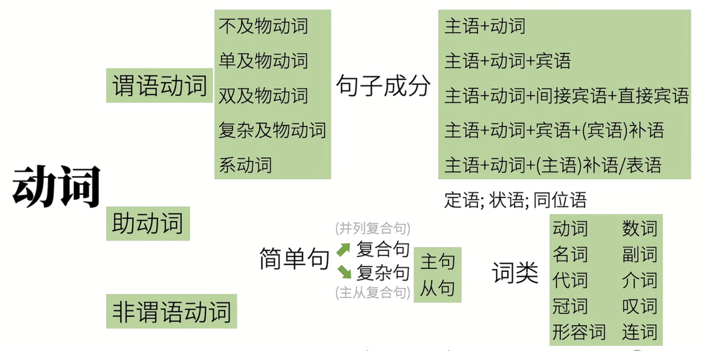

# Grammar

- [EF-Grammar](./EF-Grammar.md)
- [my grammar notes](grammar.md)

* EF 语法： https://cns.ef-cdn.com/EtownResources/Grammar/EIndex.html

* [一个视频说清整个英语语法体系(重塑你的语法认知框架)](https://www.bilibili.com/video/BV1r54y1m7gd?spm_id_from=333.999.0.0&vd_source=50ac7e35d44afea54a236dfa228f618f)

* [英语语法精讲合集 (全面, 通俗, 有趣 | 从零打造系统语法体系)](https://www.bilibili.com/video/BV1XY411J7aG?spm_id_from=333.999.0.0&vd_source=50ac7e35d44afea54a236dfa228f618f)

* [语法](http://www.yingyuyufa.com)

语法目的：**造句**

英语语法核心是**动词**

**Sentences句子**

* **Simple Sentences 简单句** (什么+怎么样=主语+谓语)：拆成不能再拆的句子然后研究语法。
  
  * 主语+谓语   Subjec(人/物)t+predicate(动作[动词verbs]/发生了什么事)
	
  * 五类谓语动词对应五大基本句型
  
  	| 动作(动词)                  | 基本句型：主语+谓语               | 例句                |
  | --------------------------- | --------------------------------- | ------------------- |
  | 可独立完成的动作            | 主语+不及物动词                   |                     |
  | 有1个动作的承受着           | 主语+单及物动词+宾语              |                     |
  | 有2个动作的承受着           | 主语+双及物动词+间接宾语+直接宾语 |                     |
  | 只有1个动作承受着(但需补充) | 主语+复杂及物动词+宾语+(宾语)补语 |                     |
  | 非"动作"                    | 主语+连系动词+(主语)补语/表语     | Papa Rabbit is tall |

  * Notes: 谓语!=谓语动词， 还有非谓语动词
  
* Compound Sentence 复合句/并列句

* Complex Sentences 复杂句：主句+从句 main clause+subordinate clause
  * 名词性从句
    * 主语从句：简单句做主语

    * 宾语从句：简单句做宾语

    * 表语从句：简单句做表语

    * 同位语从句：简单句做同谓语

  * 定语从句：简单句做定语

  * 状语从句：简单句做状语

**Clause Elements 句子成分**：

* 主语 subject

* **谓语动词** Predicate verb 🌟🌟🌟🌟🌟
* 宾语 object
* 宾语补语 object Complement
* 主语补语 Subject Complement
* 定语 Attributive：修饰主语，宾语
* 状语 Adverbial：修饰谓语动词
* 同位语 Appositive：再把主语或宾语说一遍

**词性(词类)**:同一类句子成分里有不同词类

* 名词：人/物
* 冠词：说明人/物
* 代词：替代人/物
* 形容词：形容人/物
* 数词和量词：数量
* 动词：做谓语动词，非谓语动词 (宾语，宾语，宾语补语，主语补语，定语)等
* 副词：修饰动词或形容词
* 介词：表示和其他词关系的词
* 连词：连接词和句
* 感叹词：感叹
* 肯定否定 yes，no
* 不定式前小品词to

**谓语动词的三大本领**：时体气

* tense 表示动作时间

* Aspect 表示动作状态

* Mood 表示动作假设，情感等 =动词的语气(语法的语气)：虚拟语气

  | 动作时间 | 动作状态 | 时态=时间+状态                                             |
  | -------- | -------- | ---------------------------------------------------------- |
  | 现在     | 一般     | 一般现在，一般过去，一般将来，一般过去将来                 |
  | 过去     | 完成     | 现在完成，过去完成，将来完成，过去将来完成                 |
  | 将来     | 进行     | 现在进行，过去进行，将来进行，过去将来进行                 |
  | 过去将来 | 完成进行 | 现在完成进行，过去完成进行，将来完成进行，过去将来完成进行 |

**Auxiliary Verbs助动词**:帮助谓语动词充分发挥

* 谓语动词 不能单独完成“时体气”，表示否定，可能性，必须性等

* 谓语动词eat
  * (协助)表示“吃过了(完成)”：have --> have eaten
  * (协助)表示“正在吃(进行)“：be --> is eating
  * (协助)表示“被吃“：be --> is eaten
  * (协助)表示“有能力吃”：can --> can eat
  * (协助)表示“ 有可能吃“：might --> might eat
  * (协助)表示“有义务吃”：must --> must eat
  * (协助)表示“不吃(否定)“：do --> do not eat
* 做助动词时没有实义
* 做实义词时还可以有其他词性，can可以时易拉罐

**非谓语动词**：丧失失态语气语态的本领，以以下形式出现在句中：🌟🌟🌟🌟🌟

* 动词不定式：

*  现在分词：

* 动名词：

* 过去分词：

动词的分类：

* 及物/不及物
* 动作/状态
* 完全/不完全
* 谓语/非谓语
